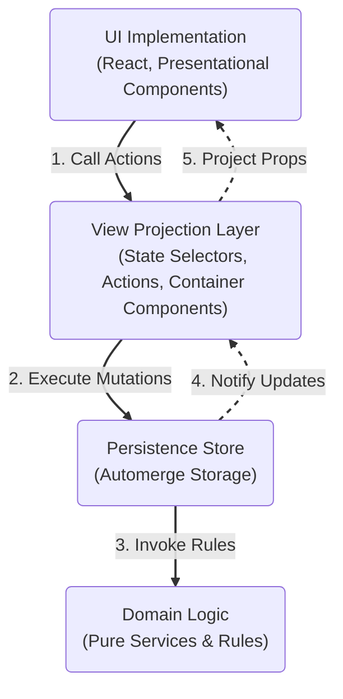

# Application Layer Architecture

> **Goal**: Maximize testability of core algorithms, minimize business logic in the UI, and decouple Automerge from business logic.

This document defines the high-level architecture for the mydoo task management system. It establishes a clean separation between the user interface, view logic, domain rules, and data persistence.

---

## Layer Overview

The system is composed of four logical layers.

- **UI Implementation**: The visible surface React components.
- **View Projection**: The translation layer that adapts raw data for the screen.
- **Domain Logic**: The "Brain" – pure algorithms and business rules.
- **Persistence Store**: The "Memory" – storage and synchronization.



---

## Design Principles

1.  **Dependency Rule**: Dependencies point "inwards" or "downwards". The UI depends on the ViewModel, which depends on the Store. The Domain is pure and depends on nothing.
2.  **Unidirectional Data Flow**: Data flows up (Store → ViewModel → UI). Commands flow down (UI → ViewModel → Store).
3.  **Pure Domain**: The core business logic (prioritization, validation) operates on plain data structures and is unaware of React or Automerge.
4.  **Service-Oriented Logic**: Complex operations are encapsulated in "Services" (Domain functions) rather than scattered in UI code.

---

## The Layers

### 1. Persistence Store ("The Memory")

**Responsibility**: Encapsulate all Automerge operations. This is the **only** layer that imports `@automerge/*`. It manages the Automerge document, handles serialization/sync, and gates all writes.

The Store calls Domain functions synchronously inside mutation transactions. It notifies the ViewModel of changes via subscriptions, which trigger re-renders.

**Pseudocode API**:

```typescript
interface PersistenceStore {
  // State Access
  getCurrentState(): Snapshot;
  subscribeToChanges(callback: () => void): void;

  // Mutations
  createEntity(kind: EntityType, data: any): void;
  updateEntity(id: string, changes: Record<string, any>): void;
  deleteEntity(id: string): void;
  moveEntity(id: string, newParent: string, position: number): void;
  transaction(description: string, operation: () => void): void;

  // Persistence
  save(): Uint8Array;
  load(data: Uint8Array): void;
}
```

---

### 2. Domain Logic ("The Brain")

**Responsibility**: Enforcing invariants, calculating derived data (like priority scores), and ensuring data integrity. This layer consists of pure functions.

The Domain does not initiate communication. Its pure functions are called by the Store inside transactions.

**Pseudocode API**:

```typescript
interface DomainServices {
  calculatePriorities(taskList: Task[], ctx: Context): DecoratedTaskList;
  healIntegrity(state: State): CleanState;
}

interface Invariants {
  assertValidMetric(value: number): void;
  assertNoCycles(tree: Tree): void;
  assertDepthLimit(tree: Tree): void;
}
```

**Key Principle**: Domain functions are called _inside_ Store transactions. This enables atomic operations while keeping domain logic Automerge-free:

```python
def recalculate_scores(self):
    def op(state: State):
        Domain.calculate_priorities(state, filter, now)

    self.transaction("Recalculate", op)
```

---

### 3. View Projection ("The Translator")

**Responsibility**: Transforming raw domain data into shapes optimized for UI rendering (e.g., trees, breadcrumbs) and orchestrating user actions into storage mutations.

The ViewModel initiates writes by calling Store methods. It projects calculated data and action callbacks to UI components as props, often through a hierarchy of intermediate Container Components.

_Note: In React, the View Projection layer often includes **container components**—components that subscribe to the Store, compute derived state, and pass pre-processed data and callbacks down to pure UI primitives. The UI Implementation layer then contains only **presentational components** that receive everything they need as arguments and contain no business logic._

**Pseudocode API**:

```typescript
// Container Component
function TaskList(): Element;

// Actions
function dispatchComplete(taskId: string): void;
function dispatchMove(taskId: string, target: string): void;
```

```python
# Component Implementation
def TaskList():
    state = store.subscribe()
    # Pure projection (State -> View Data)
    tree = project_tree_view(state)

    # Render
    items = []
    for node in tree:
        def on_toggle():
            dispatch_complete(node.id)

        def on_move(target):
            dispatch_move(node.id, target)

        items.append(TaskRow(node.title, node.is_done, on_toggle, on_move))

    return Fragment(items)

# Actions Implementation
def dispatch_complete(task_id):
    store.update(task_id, changes)
    store.recalculate()

def dispatch_move(task_id, target):
    store.move(task_id, target)
    store.recalculate()
```

---

### 4. UI Implementation ("The Face")

**Responsibility**: Rendering visual components based _only_ on the data provided by the ViewModel. It contains no state other than transient UI state (like hover or input focus).

The UI receives data from the ViewModel as _props_ (arguments passed to component functions), including the task tree, sorted lists, and current selection state. The ViewModel also provides callback functions as props; when a user interacts with the interface—clicking, dragging, or typing—the UI calls these callbacks (e.g., `actions.complete(id)`) to notify the ViewModel of the user's intent. The UI itself performs no business logic; it simply renders what it receives and invokes the callbacks it was given.

**Pseudocode Presentational Components**:

```python
def TaskRow(title: str, is_checked: bool, on_toggle: Callable, on_move: Callable) -> Element:
    return Row(
        Checkbox(is_checked, on_toggle),
        Label(title),
        DraggableHandle(on_drop=on_move)
    )

def Checkbox(checked: bool, on_change: Callable) -> Element:
    return Input("checkbox", checked, on_change)

def Label(text: str) -> Element:
    return Span(text)
```

---

## Directory Structure

```text
packages/tasklens/src/        # "The Core" (Headless)
├── domain/                   # Business logic, no Automerge
│   ├── priority.ts           # 7-pass algorithm (pure functions)
│   ├── healer.ts             # Dedup/integrity (pure functions)
│   ├── invariants.ts         # Validation: depth, cycles
│   └── index.ts
│
├── persistence/              # Automerge lives here ONLY
│   ├── store.ts              # TunnelStore class
│   ├── ops.ts                # create/update/move/delete
│   ├── schemas.ts            # Zod validation
│   └── react.ts              # useTunnel hook
│
├── types.ts                  # Pure domain types (no Automerge)
└── index.ts                  # Public exports

apps/client/src/              # "The App" (Thick Client)
├── viewmodel/                # UI-facing projections (React Hooks)
│   ├── useTaskTree.ts        # TunnelState → TunnelNode[]
│   ├── useTodoList.ts        # TunnelState → sorted Task[]
│   ├── useBreadcrumbs.ts     # Computes parent chain
│   ├── useTaskActions.ts     # Write orchestration
│   └── index.ts
│
└── components/               # Visual components
```

---

## Migration Path

### Phase 1: Extract Pure Priority Function

1. Create `domain/priority.ts` with `recalculatePriorities()`
2. Have `TunnelStore.recalculateScores()` delegate to it
3. Update algorithm tests to use plain object fixtures

### Phase 2: Move Invariants

1. Create `domain/invariants.ts`
2. Refactor `ops.ts` to call invariant functions
3. Add unit tests for invariants with plain objects

### Phase 3: Create ViewModel Layer (in `apps/client`)

1. Create `apps/client/src/viewmodel/`
2. Move `getTaskTree()` logic from `tasklens` to `client/viewmodel/useTaskTree.ts`
3. Create `client/viewmodel/useTaskActions.ts` to orchestrate writes
4. Keep `tasklens/src/react.ts` as a thin Automerge data provider (Context/Hook)

### Phase 4: Reorganize Directory Structure

1. Create `persistence/` directory
2. Move `store.ts`, `ops.ts`, `schemas.ts`, `react.ts` into it
3. Update imports across the codebase

---

## Testing Strategy

| Layer       | Test Type         | Automerge Required?      |
| ----------- | ----------------- | ------------------------ |
| Domain      | Unit tests        | ❌ No — plain objects    |
| ViewModel   | Unit tests        | ❌ No — mock persistence |
| Persistence | Integration tests | ✅ Yes                   |
| UI          | Component tests   | ❌ No — mock ViewModel   |

This architecture ensures the core algorithm is **100% testable** without Automerge overhead.

---

## References

- [automerge-schema.md](./automerge-schema.md) — Persistence layer schema
- [algorithm.md](./algorithm.md) — 7-pass priority algorithm
- [prd.md](./prd.md) — Product requirements

---

## Appendix: Reference Implementation (TypeScript)

This appendix contains concrete examples of how the pseudocode above maps to actual TypeScript implementation.

### A. Persistence Layer

**Current Files** (in `@mydoo/tasklens`):

- [`store.ts`](../../packages/tasklens/src/store.ts) — `TunnelStore` class wrapping `Automerge.Doc`
- [`ops.ts`](../../packages/tasklens/src/ops.ts) — Low-level CRUD mutations
- [`schemas.ts`](../../packages/tasklens/src/schemas.ts) — Zod runtime validation
- [`react.ts`](../../packages/tasklens/src/react.ts) — `useTunnel` hook (Automerge-React bridge)

```typescript
// persistence/store.ts
interface PersistenceLayer {
  // Read
  getState(): TunnelState;
  subscribe(callback: (state: TunnelState) => void): Unsubscribe;

  // Write (each wraps Automerge.change internally)
  createTask(props: Partial<Task>): Task;
  updateTask(id: TaskID, props: Partial<Task>): Task;
  moveTask(id: TaskID, newParentId?: TaskID, afterTaskId?: TaskID): void;
  deleteTask(id: TaskID): void;

  // Persistence
  save(): Uint8Array;
  load(data: Uint8Array): void;

  // Delegate to Domain inside transaction
  recalculateScores(filter: ViewFilter): void {
    this.doc = Automerge.change(this.doc, 'Recalculate', doc => {
      recalculatePriorities(doc, filter, Date.now());
    });
  }
}
```

### B. Domain Layer (Pure Functions)

```typescript
// domain/priority.ts
export function recalculatePriorities(
  state: TunnelState,
  filter: ViewFilter,
  currentTime: number,
): void {
  const tasks = Object.values(state.tasks);
  pass1ContextualVisibility(state, filter, currentTime);
  pass2ScheduleInheritance(tasks);
  pass3DeviationFeedback(state, tasks, getTask, getChildren);
  pass4WeightNormalization(state, tasks, getChildren);
  pass5LeadTimeRamp(tasks, currentTime);
  pass6FinalPriority(state, tasks, getAncestors);
  pass7ContainerVisibility(state, tasks, getChildren);
}

// domain/invariants.ts
export function validateDepth(state: TunnelState, parentId: TaskID): void {
  let depth = 0,
    p: TaskID | undefined = parentId;
  while (p) {
    if (++depth > 20) throw new Error('Maximum hierarchy depth exceeded');
    p = state.tasks[p]?.parentId;
  }
}

export function validateNoCycle(
  state: TunnelState,
  taskId: TaskID,
  newParentId: TaskID,
): void {
  let current = newParentId;
  while (current) {
    if (current === taskId)
      throw new Error('Cannot move task into its own descendant');
    current = state.tasks[current]?.parentId;
  }
}

// domain/healer.ts
export function deduplicateArray(ids: string[]): string[] {
  const seen = new Set<string>();
  return ids.filter(id => !seen.has(id) && seen.add(id));
}

export function healState(state: TunnelState): void {
  state.rootTaskIds = deduplicateArray([...state.rootTaskIds]);
  for (const task of Object.values(state.tasks)) {
    task.childTaskIds = deduplicateArray([...task.childTaskIds]);
  }
}
```

### C. ViewModel Layer (in `apps/client`)

```typescript
// apps/client/src/viewmodel/useTaskTree.ts
export function projectToTree(state: TunnelState): TunnelNode[] {
  // Build nested tree from flat task map
}

// viewmodel/useTodoList.ts
export function projectToTodoList(state: TunnelState): Task[] {
  return Object.values(state.tasks)
    .filter(t => t.visibility && (t.priority ?? 0) > 0.001)
    .sort((a, b) => (b.priority ?? 0) - (a.priority ?? 0));
}

// viewmodel/useBreadcrumbs.ts
export function getBreadcrumbs(state: TunnelState, taskId: TaskID): Task[] {
  const ancestors: Task[] = [];
  let current = state.tasks[taskId];
  while (current?.parentId) {
    const parent = state.tasks[current.parentId];
    if (parent) ancestors.unshift(parent);
    current = parent;
  }
  return ancestors;
}

// viewmodel/useTaskActions.ts
export function useTaskActions(store: TunnelStore) {
  return {
    complete: (id: TaskID) => {
      store.completeTask(id);
      store.recalculateScores({});
    },
    snooze: (id: TaskID, days: number) => {
      store.updateTask(id, {priorityTimestamp: Date.now()});
      store.recalculateScores({});
    },
    addChild: (parentId: TaskID, title: string) => {
      store.createTask({parentId, title});
      store.recalculateScores({});
    },
  };
}
```

### D. UI Layer (React Component)

```tsx
function TaskItem({task, actions}: {task: TunnelNode; actions: TaskActions}) {
  return (
    <li>
      <Checkbox
        checked={task.status === 'Done'}
        onChange={() => actions.toggleDone(task.id)}
      />
      <span>{task.title}</span>
      {task.children.map(child => (
        <TaskItem key={child.id} task={child} actions={actions} />
      ))}
    </li>
  );
}
```

### E. Enforcement (ESLint)

We can strictly enforce these architectural boundaries using ESLint (specifically `no-restricted-imports`), avoiding the overhead of separate packages.

| Rule               | ESLint Configuration                                  | Reasoning                                                                  |
| :----------------- | :---------------------------------------------------- | :------------------------------------------------------------------------- |
| **Domain is Pure** | Block `@automerge/*`, `react`                         | Domain logic must stay framework-agnostic and testable with plain objects. |
| **UI is Dumb**     | Block `@automerge/*`, `src/domain`, `src/persistence` | UI components should never touch the store or business logic directly.     |

**Example `.eslintrc.js` snippet**:

```javascript
{
  "overrides": [
    {
      "files": ["src/domain/**/*"],
      "rules": {
        "no-restricted-imports": ["error", { "patterns": ["@automerge/*", "react"] }]
      }
    },
    {
      "files": ["src/ui/**/*"],
      "rules": {
        "no-restricted-imports": ["error", { "patterns": ["@automerge/*", "src/persistence/*"] }]
      }
    }
  ]
}
```
