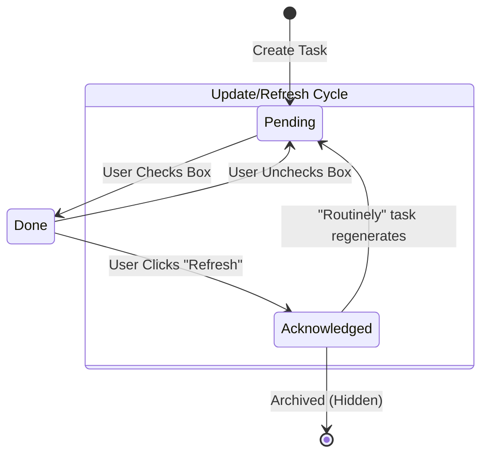

# Product Requirements Document

## Document Conventions & Maintenance

To ensure this document remains maintainable during major reorganizations, the
following conventions must be followed for all internal and external
cross-references.

### 1. Durable Anchors (Links)

Never link directly to a header string or a section number, as these change
frequently. Instead, use explicit HTML anchor tags placed immediately above the
target heading:

## 3.4 Repetition Logic

### 2. Semantic Referencing

Avoid phrases like "See Section 3.4." Use descriptive link text that points to
the stable anchor ID:

    Correct: "Refer to the [Repetition Logic](#logic-repetition) for trigger details."
    Incorrect: "See Section 3.4 for trigger details."

### 3. ID Naming Standards

- Format: Use kebab-case (lowercase, hyphens).
- Prefixing: Use functional prefixes to group related logic (e.g., `schema-`,
  `logic-`, `ui-`).
- Stability: Once an anchor ID is created and referenced elsewhere, it should
  never be changed, even if the section is moved or renamed.

### 4. External Documentation Links

When linking to companion files (e.g., ALGORITHM.md), always include the stable
anchor to the specific subsection to avoid landing the reader at the top of a
long file:

    [Credit Inheritance](./algorithm.md#credit-inheritance)

## Glossary of Concepts

| Term                     | Definition                                                                                                                                  |
| :----------------------- | :------------------------------------------------------------------------------------------------------------------------------------------ |
| **TLI (Top-Level Item)** | A root-level node in the hierarchy. Includes "Goal" roots (Health, Career) and the system "Inbox".                                          |
| **Inbox**                | A special system TLI that collects unorganized tasks. Excluded from "Balance" calculations.                                                 |
| **Credit**               | A unit of historical effort. Tasks accumulate credit upon completion, which decays over time.                                               |
| **Acknowledged**         | A state where a completed task is formally "filed away" by the user (via Refresh). It disappears from the "Do" list but remains in history. |
| **Zoom Context**         | The active parent node when navigating the Plan view on mobile (drill-down).                                                                |
| **Scoring Engine**       | The logic defined in [ALGORITHM.md](./algorithm.md) that calculates task priority.                                                          |

## 1. Core Philosophy

A local-first, synchronization-agnostic task management system. It eliminates
"list rot" by dynamically promoting tasks based on a "Life Balance" algorithm
(Target vs. Actual effort) and "Autofocus" principles (surfacing neglected
tasks). The device is the source of truth.

## 2. Technical Architecture

### 2.1 The Stack

- **Language:** TypeScript (Strict `noImplicitAny`, `strictNullChecks`).
- **Framework:** React + Vite (PWA).
- **State:** Automerge (`tasklens-store`).
- **Persistence:** IndexedDB (`rexie`).
- **Network:** WebSocket (`samod`).

### 2.2 Data Schema

The Automerge document structure is specified in
**[automerge-schema.md](./automerge-schema.md)**.

> **Key Principle**: Automerge serves exclusively as the storage and merge
> layer. The rest of the application consumes plain TypeScript objects—never
> Automerge proxies directly.

## 3. Task Lifecycle

### 3.1 Creation & Defaults

When creating a new task, apply the following defaults to ensure proper
inheritance and algorithm behavior:

| Field (UI)            | Implementation Field  | Default Value                 | Notes                                                        |
| :-------------------- | :-------------------- | :---------------------------- | :----------------------------------------------------------- |
| `importance`          | `importance`          | `0.5`                         | Neutral value. Set at creation to 0.5.                       |
| `effort`              | `creditIncrement`     | Parent's value, or `0.5`      | Copied from parent at creation. Root defaults to `0.5`.      |
| `leadTime`            | `schedule.leadTime`   | `28,800,000` (8 hours)        | Stored in milliseconds.                                      |
| `notes`               | `notes`               | `undefined`                   | Optional.                                                    |
| `scheduleType`        | `schedule.type`       | `'Once'`                      | Enumeration: Once, Routinely, DueDate, Calendar.             |
| `dueDate`             | `schedule.due`        | `undefined`                   | Timestamp (milliseconds).                                    |
| `period`              | `schedule.period`     | `86,400,000` (24 hours)       | For Routines. Stored in milliseconds.                        |
| `placeId`             | `placeId`             | Parent's value, or `ANYWHERE` | Copied from parent at creation. Root defaults to `ANYWHERE`. |
| `lastReviewTimestamp` | `lastReviewTimestamp` | `Date.now()`                  | For staleness calculation.                                   |
| `status`              | `status`              | `'Pending'`                   | Active state.                                                |
| `childIds`            | `childTaskIds`        | `[]`                          | Starts with no children.                                     |

#### Inheritance Semantics

The system uses two distinct inheritance strategies:

1. **Fixed Default** (Importance):
   - **Importance**: Always initializes to `0.5` (middle value). It does NOT
     inherit from the parent.

2. **Copy-on-Create** (Effort, Place): The value is determined at task creation
   by copying the parent's value (or using a default if Root). From that point
   forward, the task ignores any changes to ancestor values.
   - **Effort** (`creditIncrement`): Copies the parent's effort, or `0.5` if the
     task is a root.
   - **Place** (`placeId`): Copies the parent's place, or `ANYWHERE` if the task
     is a root.

3. **Recursive Fallback** (Schedule for "Once" type):
   - **Trigger**: Applies ONLY when `schedule.type` is `'Once'`.
   - **Logic**: If the task has no ancestors with an active schedule, it is
     stateless regarding time. If an ancestor has a schedule, this task inherits
     the parent's effective due date and lead time at runtime.

### 3.2 State Transitions

The lifecycle of a task flows through distinct states, driven by user actions
and system generation.

### 3.3 Completion & Acknowledgment

When a task is marked **Done**:

1.  **Immediate Effect**: It stays visible in the "Do" list with a
    strikethrough. This allows simple undoing of accidental clicks.
2.  **Acknowledgment**: When the user clicks the global **"Update/Refresh"**
    button, all "Done" tasks transition to **Acknowledged**.
    - **Effect**: They are removed from the "Do" list view.
    - **Data**: The `isAcknowledged` flag is set to `true` in the Automerge
      document.
    - **History**: The task remains in the document history for "Balance" credit
      calculations.
    - **Scheduling**: If the task is `Routinely` or `Calendar`, this triggers
      the generation of the next instance (see Section 3.4).

### 3.4 Scheduling Subsystem

The scheduling logic is polymorphic, controlled by the `schedule.type` field.
The UI exposes this via the **"Happens"** menu.

#### Type 0: "Once" (Default)

- **Concept**: A simple task that happens one time.
- **Data**: `schedule.type = 'Once'`.
- **Behavior**:
  - Implicitly inherits schedule constraints from ancestors (Recursive
    Fallback).
  - If no scheduled ancestor exists, it appears in the "Do" list based solely on
    Place/Importance.
  - Does NOT repeat.

#### Type 1: "Routinely" (Floating Interval)

- **Concept**: A task that recurs based on when it was last done (e.g., "Clean
  Fridge every 3 days").
- **Data**: `schedule.type = 'Routinely'`.
- **Fields**:
  - `period`: Scalar interval in milliseconds (default `86,400,000` / 24h).
  - `lastDone`: Timestamp of previous completion.
- **Logic**:
  - **Next Due Date** = `lastDone` + `period`.
  - **On Completion**: When the user explicitly "Refreshes" (acknowledges):
    1. Update `lastDone` to the completion time.
    2. Reset `status` to `Pending` (un-check the box).
    3. Recalculate `schedule.due`.

#### Type 2: "By Calendar" (Deferred/Future)

- **Concept**: Task linked to specific calendar events (e.g., "Weekly Meeting").
- **Data**: `schedule.type = 'Calendar'`.
- **Behavior**: Manages a one-to-many relationship with an `appointments` list.
- **Logic**: The `schedule.due` field acts as a projection (cache) of the
  nearest future appointment.

#### Type 3: "By Due Date" (Scalar Deadline)

- **Concept**: A hard deadline (e.g., "Submit Tax Return").
- **Data**: `schedule.type = 'DueDate'`.
- **Behavior**:
  - Functions like a Calendar task but effectively Single Occurrence.
  - `schedule.due` holds the explicit user-set timestamp.
  - `schedule.leadTime` determines when it starts floating to the top of the
    list.
  - Does NOT repeat automatically (effectively `Once` but with explicit date).

### 3.5 Deletion Logic

Deletion is a destructive, cascading action.

1.  **Warning:** If a task has children, the UI **MUST** prompt: "Delete
    'Project X' and [N] sub-tasks?".
2.  **On Confirm:** Hard-delete the target task AND all its descendants.
    Reference in `parent.childIds` or `rootTaskIds` is removed.
3.  **No Undo**: Deletion is permanent (barring Automerge time-travel features).

## 4. Data Integrity & Conflict Resolution

### 4.1 ID Generation & Duplicate Prevention

To safely handle offline repetition on multiple devices:

1.  **Standard Tasks**: `UUID v4`.
2.  **Routinely/Calendar**:
    - **Routinely**: Typically uses a stable ID (SINGLETON) that recycles
      itself.
    - **Calendar**: The core Task has a stable ID; individual appointments (if
      expanded) would have their own IDs (future scope).

### 4.2 The "Healer" Routine

Functions as a self-repair mechanism running on **App Load** and **Post-Sync**.

**A. Array Sanitization (Deduplication)** Automerge list merges can create
duplicates (e.g., `[A, B, B, C]`).

- **Rule**: "First-Occurrence-Wins".
- **Logic**: Iterate `rootTaskIds` and `childIds`. Keep the first instance of
  any ID; remove subsequent duplicates.

### 4.3 Inbox Structure

- **Fixed ID**: `ROOT_INBOX_ID`.
- **Behavior**:
  - It defines the default entry point.
  - It is **excluded** from "Balance" scoring (tasks inside are not weighted
    against Career/Health goals).
  - It cannot be deleted.

### 4.4 Scoring Engine Integration

The application relies on the definition in [ALGORITHM.md](./algorithm.md) (The
"Scoring Engine") to calculate:

1.  **Credits**: Historical effort tracking.
2.  **Staleness**: Auto-focus pressure ([STALENESS.md](./staleness.md)).
3.  **Priority**: The final sorting order for the "Do" list.

**Invariant**: Adding or removing a sibling MUST NOT change any existing task's
priority in the Do list (except for sequential gating). Importance is absolute,
not normalized across siblings.

See also: [ALGORITHM_TEST_SUITE.md](./test-suite.md) for compliance test
fixtures.

## 5. UX/UI Specification

### 5.1 Global Navigation Paradigm

- **Mobile**: Bottom Tabs (Do, Plan, Balance, Context).
- **Desktop**: Split Pane (Plan | Do).

### 5.2 The "Do" View (Primary)

- **Visual Structure:** A flat list of tasks sorted **purely by computed
  priority score**. There are no section headers or temporal groupings (e.g.,
  "Overdue", "Today", "Later").
- **Strict Actionability**: The Do list is strictly for **"things I can
  physically do right now"**. It is not a planning tool or a pipeline view.
  - If a task is scheduled for the future, it is hidden.
  - If a task is for a different place (Context), it is hidden.
  - If a Project contains only hidden tasks, the Project itself is hidden.
- **Filter Logic:** Shows tasks where `Visibility = True` per
  [ALGORITHM.md](./algorithm.md) Pass 1.
- **Context Filter:** Header dropdown (e.g., "Home", "Work"). Place filtering
  logic is defined in ALGORITHM.md §3.2.
- **Task Row Elements:**
  - **Left:** Checkbox.
  - **Center:** Task Title + Small Metadata text (Parent Project Name, Due Date
    icon).
  - **Visual Cues:**
    - **Overdue:** Red text/accent.
    - **Neglected/Stale:** Per [STALENESS.md](./staleness.md), show visual
      indicator when `StalenessFactor > 1.5`.
    - **Inbox:** Distinct border to denote unfiled status.

- **Interactions:**
  - **Checkbox:** Toggles task status. Checking sets `status = 'Done'` and
    triggers credit attribution. Unchecking reverts to `status = 'Pending'`.
  - **"Update/Refresh" Button:** Runs Repetition Logic (generates next
    instances), triggers "Healer", and **acknowledges completed tasks**
    (removing them from the Do list).
  - **Floating Action Button (Mobile):** Adds a new task directly to the
    **Inbox**.

> [!IMPORTANT] **Completed Task Visibility Lifecycle**
>
> When a task is marked "Done", it remains visible in the Do list with a
> strikethrough until acknowledged. This allows the user to see what they
> accomplished and to undo accidental completions.
>
> **The acknowledgment occurs when the user presses the Refresh button**, which
> sets `isAcknowledged = true` on finished tasks. Tasks with `isAcknowledged`
> are hidden from the Do view but remain in the document for history and the
> Balance view's credit tracking.
>
> **Persisted State**: The `isAcknowledged` flag is stored in the Automerge
> document (synced across devices).

### 5.3 The "Plan" View (Outline)

- **Structure**: Indented tree view. Infinite nesting supported.
- **Root Nodes**: Fixed "Inbox" node (pinned at top) + User TLIs.
- **Navigation (Hybrid)**:
  - **Desktop (Tree Mode)**: Full outline visible with expand/collapse chevrons
    (`>`).
  - **Mobile (Drill-Down Mode)**: Drill-down navigation only. Tapping a parent's
    **arrow icon** "zooms in" to show only its children. A **breadcrumb trail**
    at the top shows the current path.
- **Interaction & Creation**:
  - **Desktop (Hover Menu)**: Hovering a row reveals a `•••` menu trigger
    (replacing the bullet). Menu options: "Add Sibling", "Add Child", "Delete".
  - **Mobile (Bottom Bar)**: Persistent toolbar at the bottom of the Plan view
    (above global nav). Contains `[<]` (Up Level) and `[+]` (Add to Top of
    current view).
  - **Append Row**: A `[ + ]` row at the very bottom of the list (Desktop &
    Mobile) allows adding tasks to the end of the current zoom level.
  - **Navigation Feedback**: Creating a task triggers "Highlight & Reveal":
    - **Desktop**: Auto-expands parent, auto-scrolls to new task row, new task
      row flashes yellow.
    - **Mobile**: Auto-drills into the parent task (showing its children,
      including the new one), auto-scrolls to new task row, new task row flashes
      yellow.
  - **Edit Task**: Tap task **Title or Row** to open Edit modal.

### 5.4 The "Balance" View

- **UI**: List of Top-Level Items (excluding Inbox).
- **Controls**: Slider for "Desired %".
- **Feedback**: Visual bar for "Actual %" (computed from `effort` history). If
  Actual < Target, the row is highlighted to show it is "Starving" (boosting
  priority).

### 5.5 Task Editing (Details Modal)

Since there is no "selection" state on mobile, tapping any task text opens a
full-screen modal (Mobile) or centered Popup (Desktop).

**Modes:**

- **Create Mode**: Opens with empty fields. Hierarchy controls are hidden.
  "Save" creates the task and closes the modal.
- **Edit Mode**: Opens with existing data. Hierarchy controls are visible.

| Feature                | Create Mode     | Edit Mode                    |
| :--------------------- | :-------------- | :--------------------------- |
| **Title**              | Empty (Focus)   | Existing Value               |
| **Hierarchy Controls** | **Hidden**      | **Visible**                  |
| - _Indent / Outdent_   | N/A             | Available (Immediate Action) |
| - _Move Picker_        | N/A             | Available                    |
| **Commit Action**      | "Save" (Create) | "Close" (Auto-save)          |
| **Delete**             | Cancel          | Delete Button                |

**Modal Contents:**

1.  **Title**: Text input.
2.  **Navigation & Hierarchy (Edit Mode Only)**:
    - **Parent**: Read-only label showing current parent.
    - **Hierarchy Controls**:
      - `[← Outdent]`: Moves task up one level (becomes sibling of parent).
        - **Edge Case (Mobile)**: If the task is a direct child of the current
          zoom context, outdenting moves it out of view. In this case, the
          system **MUST** auto-navigate up one level so the task remains
          visible.
      - `[Indent →]`: Moves task to become child of previous sibling.
      - **"Move..." Button**: Opens a picker modal for precise reparenting.
      - **Note**: Hierarchy actions (Indent, Outdent, Move) are applied
        **immediately** to the database.
    - **"Find in Plan" Button**: Closes modal and navigates to task in Plan
      view.
3.  **Status/Logic**:
    - **Importance**: Slider (0.0 - 1.0).
    - **Effort**: Slider (0.0 - 1.0).
4.  **Scheduling ("Happens")**:
    - **Menu**: [ Once | Routinely | By Due Date | By Calendar ].
    - **Once**: No extra fields.
    - **Routinely**:
      - **Every**: Number input (e.g., "3").
      - **Unit**: Dropdown (Days | Weeks | Months | Years).
      - **Lead Time**: Number input (Days, stored as milliseconds).
    - **By Due Date**:
      - **Date**: Date Picker.
      - **Lead Time**: Number input (Days, stored as milliseconds).
    - **By Calendar**: (Deferred) Linked Event UI.
5.  **Context**:
    - **Place**: Dropdown picker linking to `RootDoc.places`.
6.  **Notes**: Multi-line text area (Markdown).
7.  **Footer Actions (The "Next Step" Workflow)**:
    - **"Add Sibling Task"**: Creates a new task under the _same_ parent.
    - **"Add Child Task"**: Creates a new task under _this_ task.
    - **"Delete Task"**

### 5.6 Visual Feedback

- **Sync Status**: Green (Synced), Yellow (Syncing), Gray (Offline).
- **Priority**: Order implies importance; do not show raw numbers.

## 6. Future Enhancements

(Deferred to post-MVP)

1.  **Snooze/Defer Task**: Hide until a specific date. Would require a
    `snoozeUntil` field and priority suppression logic.
2.  **Drag-and-Drop Reorganization**: Direct manipulation of task hierarchy in
    the Plan view. MVP uses the Move picker instead.
3.  **Archive/Cleanup Completed Tasks**: Bulk deletion of tasks completed more
    than N days ago.
4.  **Calendar View**: Visual timeline of tasks with due dates.
5.  **Search**: Full-text search across task titles and notes.
6.  **Tags/Labels**: Additional categorization beyond Places.

## 7. Implementation Guide

### 7.1 Type Definitions

See [automerge-schema.md](./automerge-schema.md) for schema documentation.

The canonical TypeScript implementation is in
[`@mydoo/tasklens`](file:///Users/matt/src/mydoo/packages/tasklens):

- [`types.ts`](file:///Users/matt/src/mydoo/packages/tasklens/src/types.ts) —
  TypeScript interfaces
- [`schemas.ts`](file:///Users/matt/src/mydoo/packages/tasklens/src/schemas.ts)
  — Zod validation

### 7.2 Algorithm

See [ALGORITHM.md](./algorithm.md) for the scoring logic "Source of Truth".
