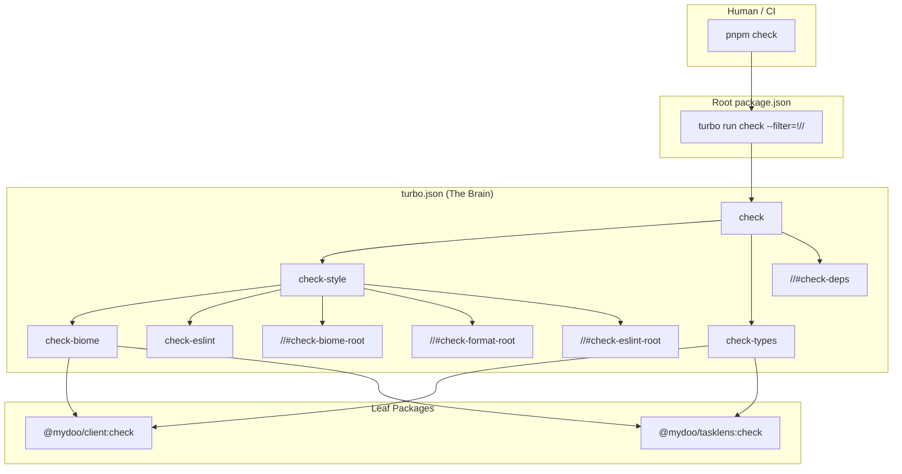

# Monorepo Architecture: The Switchboard Pattern

This architecture strictly separates **Orchestration** (Root) from **Execution** (Leaves). It eliminates "split-brain" where the root relies on manual scripts while packages rely on Turbo.

> [!NOTE]
> This document describes an ideal architectural pattern, not a prescriptive implementation. The actual `turbo.json` in this repository may have additional complexity or variation for pragmatic reasons.

## 1. Core Philosophy

1.  **The Root is the Interface:** The root `package.json` is for Humans and CI. It contains NO logic. Every script delegates to `turbo`.
2.  **The Leaf is the Implementation:** Package `package.json` files contain the raw tools (`vite`, `tsc`, `biome`).
3.  **Everything is a Node:** `docs`, code, and configuration are all treated as nodes in the execution graph.

## 2. The Standard Verbs

Standardize these across the entire repo. If a package doesn't support a verb, it simply omits the script.

- **`dev`**: Start development servers (watch mode).
- **`build`**: Compile/transpile for production.
- **`test`**: Run unit/integration tests.
- **`check`**: Read-only validation (Lint, Typecheck, Format Check). Safe for CI. Exits 1 on error.
- **`fix`**: Write/Modify validation (Auto-format, Auto-fix). Safe for Local.

---

## 3. Execution Flow Diagram

The following diagram illustrates how a single `pnpm check` command fans out through Turbo's task graph:



---

## 4. Configuration & Implementation

### A. The Root `package.json` (The Interface)

**Rationale:** Acts as the entry point. It captures intents, not tools. The `--filter=!//` flag excludes the root package itself, ensuring only leaf packages are targeted.

```json
{
  "name": "monorepo-root",
  "private": true,
  "packageManager": "pnpm@10.x",
  "scripts": {
    "dev": "turbo run dev --filter=!//",
    "build": "turbo run build --filter=!//",
    "test": "turbo run test --filter=!//",
    "check": "turbo run check --filter=!//",
    "fix": "turbo run fix --filter=!//"
  }
}
```

### B. The `turbo.json` (The Brain)

**Rationale:** Defines the task dependency graph.

- **Root Tasks (`//#`)**: Handle root-level files (config, READMEs) that aren't part of any leaf package.
- **Leaf Tasks**: Discovered automatically in packages that define the corresponding script.

```jsonc
{
  "$schema": "https://turbo.build/schema.json",
  "tasks": {
    "build": {
      "dependsOn": ["^build"],
      "outputs": ["dist/**", ".next/**"],
    },
    "test": {
      "dependsOn": ["build"],
    },

    // --- THE "CHECK" VERB (Read Only) ---
    "check": {
      "dependsOn": [
        "^check",
        "//#check-biome-root",
        "//#check-format-root",
        "//#check-eslint-root",
      ],
    },
    "//#check-biome-root": {"inputs": ["*"]},
    "//#check-format-root": {"inputs": ["*"]},
    "//#check-eslint-root": {"inputs": ["*"]},

    // --- THE "FIX" VERB (Write) ---
    "fix": {
      "dependsOn": [
        "^fix",
        "//#fix-biome-root",
        "//#fix-format-root",
        "//#fix-eslint-root",
      ],
      "cache": false,
    },
    "//#fix-biome-root": {"cache": false},
    "//#fix-format-root": {"cache": false},
    "//#fix-eslint-root": {"cache": false},
  },
}
```

### C. The Leaf `package.json` (The Code)

**Location:** `apps/client`, `packages/ui`
**Rationale:** Raw tool execution. No "turbo" commands allowed here.

```jsonc
{
  "name": "web-client",
  "scripts": {
    "dev": "vite",
    "build": "vite build",
    "check": "run-p check-types check-biome check-eslint",
    "check-types": "tsc --noEmit",
    "check-biome": "biome check src/",
    "check-eslint": "eslint src/",
    "fix": "run-p fix-biome fix-eslint",
    "fix-biome": "biome check --write src/",
    "fix-eslint": "eslint --fix src/",
    "test": "vitest",
  },
}
```

> [!NOTE]
> This example uses `npm-run-all` (`run-p`) to run sub-tasks in parallel. The leaf package runs its own linters on its own `src/` directory, while root tasks handle root-level files.

### D. The Docs `package.json` (The Content)

**Location:** `docs/package.json`
**Rationale:** Makes the `docs` directory a legitimate citizen of the build graph.

```jsonc
{
  "name": "docs-site",
  "private": true,
  "scripts": {
    // If you use Biome at the root, you might not need this.
    // If you use Prettier specifically for docs:
    "check": "prettier --check .",
    "fix": "prettier --write .",
  },
}
```

## 5. Handling Specific Scenarios

### Handling Root Files

Root-level files (`README.md`, `eslint.config.js`, `turbo.json`, etc.) are not part of any leaf package, so they require explicit Turbo **Root Tasks** (`//#task-name`) to be processed.

The pattern uses multiple root tasks—one per tool—that are wired as dependencies of the main `check` and `fix` tasks. Task names use the `-root` state suffix per the [task-naming guidelines](file:///Users/matt/src/mydoo/docs/guidance/task-naming.md):

```jsonc
{
  "tasks": {
    // The main verbs aggregate all root tasks as dependencies
    "check": {
      "dependsOn": [
        "^check", // Leaf packages
        "//#check-biome-root", // Biome on root files
        "//#check-format-root", // Prettier on root files
        "//#check-eslint-root", // ESLint on root config files
      ],
    },
    "fix": {
      "dependsOn": [
        "^fix",
        "//#fix-biome-root",
        "//#fix-format-root",
        "//#fix-eslint-root",
      ],
      "cache": false,
    },

    // --- Root Tasks: One per tool ---
    // NOTE: We use "*" for inputs rather than tool-specific globs. This causes
    // slightly more cache invalidation (any root file change busts all root task
    // caches), but root files change infrequently and this eliminates the need
    // to keep turbo.json inputs in sync with script globs.

    // Biome: Lints JSON, JS, TS files at the root
    "//#check-biome-root": {
      "inputs": ["*"],
      "outputs": [],
    },
    "//#fix-biome-root": {
      "cache": false,
    },

    // Prettier: Formats markdown, YAML, and other files
    "//#check-format-root": {
      "inputs": ["*"],
      "outputs": [],
    },
    "//#fix-format-root": {
      "cache": false,
    },

    // ESLint: Checks root config files (if applicable)
    "//#check-eslint-root": {
      "inputs": ["*"],
      "outputs": [],
    },
    "//#fix-eslint-root": {
      "cache": false,
    },
  },
}
```

The corresponding scripts in the root `package.json` provide the actual commands:

```jsonc
{
  "scripts": {
    // These are called by Turbo's root tasks.
    // IMPORTANT: Most tools default to recursive directory scanning, which would
    // cause double-processing of package files. Use explicit globs (e.g., *.json)
    // rather than '.' to restrict each tool to root-level files only.
    // IMPORTANT: The turbo.json 'inputs' must include at least the files that
    // the command processes. Otherwise, changes to those files won't invalidate
    // the cache.
    "check-biome-root": "biome check *.json *.js *.mjs *.cjs",
    "fix-biome-root": "biome check --write *.json *.js *.mjs *.cjs",
    "check-format-root": "prettier --check '*.md' '*.yaml' '*.yml'",
    "fix-format-root": "prettier --write '*.md' '*.yaml' '*.yml'",
    "check-eslint-root": "eslint *.config.js *.config.ts",
    "fix-eslint-root": "eslint --fix *.config.js *.config.ts",
  },
}
```

**Key Points:**

- Each tool gets its own root task with appropriate `inputs` for caching.
- The main `check` and `fix` tasks depend on all relevant root tasks.
- Leaf packages still use `--filter=!//`, but root tasks are explicitly wired via `dependsOn`.
- This avoids running the same tool twice on the same files (once globally, once per-package).

### The `scripts/` Directory

A `scripts/` directory containing shell scripts (`.sh`) does not require linting by Biome or ESLint—those tools are for JS/TS. There are two approaches:

**If `scripts/` contains only shell scripts:**

- No action needed. ShellCheck or similar tools can be invoked via a dedicated root task (`//#check-shellcheck-root`) if desired.
- Do **not** add `scripts/` to Biome or ESLint root tasks.

**If `scripts/` contains JavaScript or TypeScript:**

- Per the "Everything is a Node" philosophy, add a `scripts/package.json` to make it a proper workspace member.
- Define its own `check` and `fix` scripts, which Turbo will discover automatically.

### Subdirectories (`docs/`, `scripts/`, etc.)

Any subdirectory that contains lintable files **should have its own `package.json`** to become a proper workspace member. This follows the "Everything is a Node" philosophy and ensures:

- The directory participates in Turbo's task graph
- Caching works correctly at the directory level
- No overlap with root tasks (root tasks handle _only_ root-level files)

Example for `docs/`:

```jsonc
{
  "name": "docs",
  "private": true,
  "scripts": {
    "check": "prettier --check .",
    "fix": "prettier --write .",
  },
}
```

### Root Filtering with `--filter=!//`

The root `package.json` scripts use `--filter=!//` to exclude the root package from _package-level_ task discovery. This prevents Turbo from attempting to run a script (like `check`) on the root itself.

> [!IMPORTANT]
> This filter does **not** prevent root tasks (`//#*`) from running. Root tasks are explicitly wired via `dependsOn` and execute regardless of the filter. The filter only affects which _packages_ are included in the task run.
