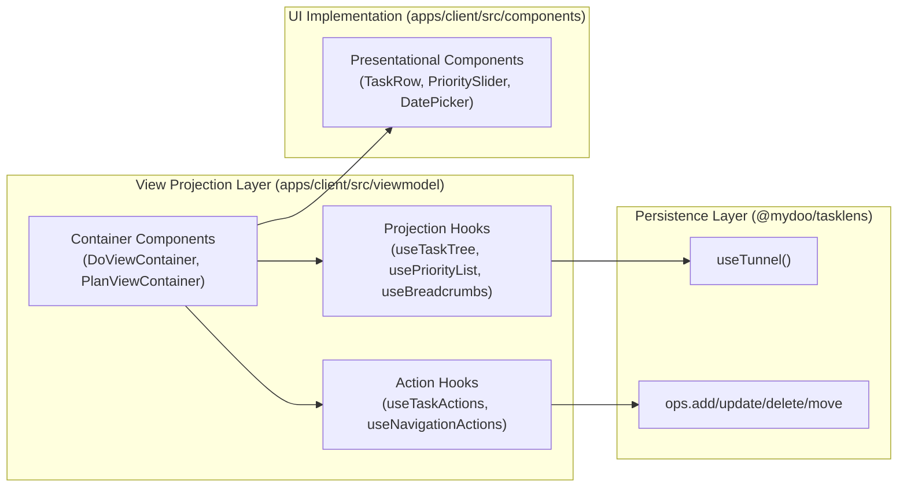
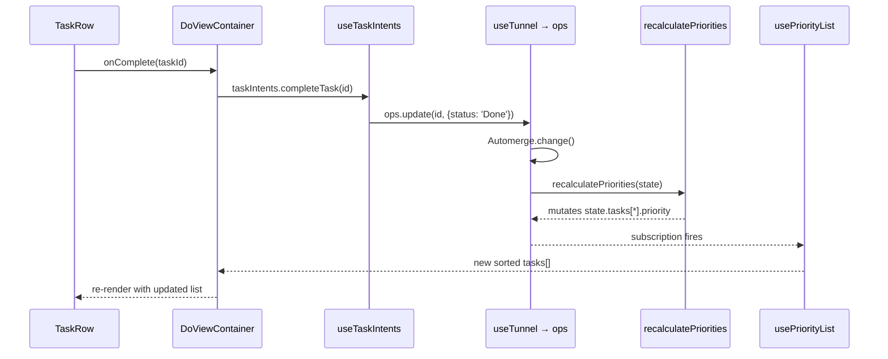
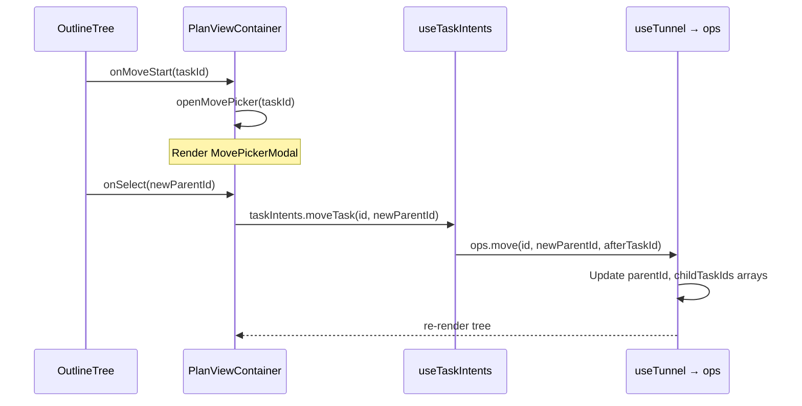

# View Projection Layer Specification

> **Purpose**: This document specifies the View Projection Layer (ViewModel) for the mydoo task management application. It defines the React hooks, container components, action handlers, and UI primitives needed to connect the Domain/Persistence layers to the user interface.

---

## 1. UI Framework Recommendation

### 1.1 Requirements Analysis

Based on the [PRD](./prd.md) and [Architecture](./architecture.md), the View Projection Layer requires:

| Feature                        | Priority | Notes                                        |
| ------------------------------ | -------- | -------------------------------------------- |
| Tree/Outline rendering         | High     | Nested task hierarchy with expand/collapse   |
| Drag-and-drop reordering       | High     | Move tasks between parents, reorder siblings |
| Modal/Drawer system            | High     | Task details editor, move picker             |
| Responsive mobile-first design | High     | PWA target with bottom navigation            |
| Date/Time pickers              | Medium   | Due dates, scheduling                        |
| Sliders                        | Medium   | Importance (0-1), Balance % targets          |
| Bottom navigation tabs         | Medium   | Do/Plan/Balance/Context navigation           |
| Segmented controls             | Medium   | Effort selector (1/3/5)                      |
| Skeleton loaders               | Low      | Loading states                               |
| Notifications/Toasts           | Low      | Sync status, errors                          |

### 1.2 UI Layer Strategy

Instead of mandating a specific UI framework, this specification defines the **capabilities** required of the selected UI library. The implementation should choose a library (e.g., Mantine, Material UI, ShadCN, or TailwindUI) that satisfies these constraints:

| Capability            | Requirement                                                                            |
| :-------------------- | :------------------------------------------------------------------------------------- |
| **Bundle Size**       | Must support tree-shaking and remain lightweight for PWA performance.                  |
| **Mobile Navigation** | Must support a bottom tab bar or similar mobile-first navigation pattern.              |
| **Input Primitives**  | Needs rich inputs (Sliders, DatePickers, SegmentedControls) out of the box.            |
| **Theming**           | Must support CSS variables and dark mode to meet the "vibrant aesthetics" goal.        |
| **Layouts**           | Must support responsive Application Shells (Split Pane on Desktop, Tab Bar on Mobile). |

### 1.3 Selected UI Library: Mantine v7

**Rationale:**

- ✅ **Meets all requirements**: Excellence in forms (`@mantine/form`), dates (`@mantine/dates`), and accessibility.
- **Bundle Size**: ~60KB gzipped (Core + Hooks + Form + Dates), fitting PWA targets.
- **Developer Experience**: TypeScript-first, extensive hooks library (`use-hotkeys`, `use-os`, `use-viewport-size`).

**Installation:**

```bash
pnpm add @mantine/core @mantine/hooks @mantine/form @mantine/dates dayjs
pnpm add -D postcss postcss-preset-mantine postcss-simple-vars
```

---

## 2. Core Concepts

### 2.1 The "Display Item" Pattern

The Domain/Persistence Layer operates on `Task` and `Place` objects stored in Automerge. The UI layer, however, should operate on **Display Items**—decorated domain objects augmented with computed properties and ephemeral UI state.

> [!IMPORTANT]
> **Rule**: UI Components never receive raw Automerge objects. They receive Read-Only View Models.

**Naming Convention:**

- Projection types for lists: `*DisplayItem` (e.g., `TaskDisplayItem`, `TreeDisplayNode`)
- Enriched detail views: `*Details` (e.g., `TaskDetails`)
- Balance/aggregate views: `*Item` (e.g., `BalanceItem`)

### 2.2 Transient State vs. Persistent State

| State Type     | Examples                                                           | Storage                                         |
| -------------- | ------------------------------------------------------------------ | ----------------------------------------------- |
| **Persistent** | Task title, status, parent, schedule                               | Automerge document                              |
| **Transient**  | Tree node expansion, active tab, scroll position, modal open state | React state / `localStorage` / `sessionStorage` |

The View Projection layer is responsible for **merging these two sources** before passing data to the UI. For example, `TreeDisplayNode` combines the persistent `Task.childTaskIds` with the transient `expandedIds` set to determine whether to recursively project children.

### 2.3 Callback Pattern: ID-Passing

Presentational components receive callback props that require the item ID as an argument (e.g., `onToggle(taskId)`) rather than pre-bound callbacks embedded in display items (e.g., `task.onComplete()`).

**Rationale:**

- **Referential stability**: Callbacks can be defined once in the container and passed down without creating new function objects per item per render.
- **Memoization-friendly**: Easier to use with `React.memo()` and `useCallback()`. _(Memoization = caching a computed value so it isn't recalculated on every render.)_
- **Clearer data flow**: The component explicitly shows what data flows up (the ID) rather than hiding it in a closure.

### 2.4 User Intents Pattern

Action hooks expose methods named as **User Intents**—semantic descriptions of what the user wants to accomplish, not low-level CRUD operations.

**Pattern:**

```typescript
interface TaskIntents {
  /** Intent: "I finished this task"
   *  Effects: Sets status=Done, triggers recurrence generation, runs healer */
  completeTask(id: TaskID): void;

  /** Intent: "This task belongs elsewhere"
   *  Effects: Updates parentId, reorders childIds arrays, recalculates tree */
  moveTask(id: TaskID, newParentId: TaskID | undefined): void;
}
```

**Rationale:**

- **Abstraction**: The UI doesn't need to know about cascading effects (recurrence, healer, score recalculation).
- **Single responsibility**: Each intent maps to one user action, even if it triggers multiple store mutations.
- **Extensibility**: New intents can be added without changing the component signatures.

> [!TIP]
> When adding new actions, ask: "What is the user trying to accomplish?" Name the method after the goal, not the mechanism.

---

## 3. Layer Boundaries



**Dependency Rule:**

| Layer            | May Import                                                | Must NOT Import                                         |
| ---------------- | --------------------------------------------------------- | ------------------------------------------------------- |
| Projection Hooks | `@mydoo/tasklens`, React                                  | `@automerge/*`, UI components                           |
| Action Hooks     | `@mydoo/tasklens`, React                                  | `@automerge/*`, UI components                           |
| Containers       | Projection Hooks, Action Hooks, Presentational Components | `@automerge/*`, `@mydoo/tasklens` persistence internals |
| Presentational   | React, Selected UI Library                                | Everything else                                         |

---

## 3. Projection Hooks (State Selectors)

Projection hooks transform raw `TunnelState` into UI-ready shapes. They are **pure projections** with no side effects.

### 3.1 `useDocument()`

**Purpose**: Provide the opaque document handle (URL) for the current session.

```typescript
function useDocument(): AutomergeUrl;
```

**Behavior:**

- On first load, checks `localStorage` for existing document URL
- If none exists, creates new document via `RepoContext`
- Returns stable `AutomergeUrl` for downstream hooks

**Location**: `apps/client/src/viewmodel/useDocument.ts`

---

### 3.2 `useTaskTree(docUrl: AutomergeUrl)`

**Purpose**: Project flat task map into nested tree structure.

```typescript
interface UseTaskTreeResult {
  tasks: TunnelNode[]; // Full tree with resolved children
  doc: TunnelState | undefined;
  isLoading: boolean;
}

function useTaskTree(docUrl: AutomergeUrl): UseTaskTreeResult;
```

**Memoization**: Tree construction should be memoized on `doc` identity.

**Location**: `apps/client/src/viewmodel/useTaskTree.ts`

---

### 3.3 `usePriorityList(docUrl: AutomergeUrl, filter: ViewFilter)`

**Purpose**: Project tasks into a **sorted, filtered** list for the "Do" view.

```typescript
interface PriorityTask extends Task {
  parentTitle?: string; // Resolved parent name for context
  isOverdue: boolean; // Computed from schedule.dueDate
  isStale: boolean; // StalenessFactor > 1.5
  urgency: number; // 0.0 - 1.0 (Visual color coding)
  depth: number; // Distance from root (for indent in flat list)
}

interface UsePriorityListResult {
  tasks: PriorityTask[];
  isLoading: boolean;
}

function usePriorityList(
  docUrl: AutomergeUrl,
  filter: ViewFilter,
): UsePriorityListResult;
```

**Behavior:**

1. Subscribe to `TunnelState` changes via `useTunnel()`
2. Filter tasks per `filter.placeId` and `filter.includeClosed`
3. Filter to `visibility === true` (Pass 1 from ALGORITHM.md)
4. **Exclude tasks where `isAcknowledged === true`** (these have been acknowledged/hidden from Do list)
5. Sort by `priority` descending
6. Enrich with `parentTitle`, `isOverdue`, `isStale`

> [!NOTE]
> The list is sorted **purely by computed priority**. There are no section groupings (e.g., "Overdue", "Today", "Later"). Overdue items, items due today, and items due later are intermixed based on their priority score.

**Location**: `apps/client/src/viewmodel/usePriorityList.ts` (NEW)

---

### 3.4 `useTodoList(tasks: TunnelNode[], viewPath: TaskID[])`

**Purpose**: Extract the subtree visible at the current navigation path.

```typescript
interface UseTodoListResult {
  currentList: TunnelNode[] | undefined;
  parentNode: TunnelNode | undefined;
  isPathValid: boolean;
}

function useTodoList(
  tasks: TunnelNode[],
  viewPath: TaskID[],
): UseTodoListResult;
```

**Location**: `apps/client/src/viewmodel/useTodoList.ts`

---

### 3.5 `useBreadcrumbs(tasks: TunnelNode[], viewPath: TaskID[])`

**Purpose**: Generate navigation breadcrumb trail.

```typescript
type BreadcrumbItem =
  | {type: 'root'}
  | {type: 'task'; id: TaskID; title: string};

function useBreadcrumbs(
  tasks: TunnelNode[],
  viewPath: TaskID[],
): BreadcrumbItem[];
```

**Location**: `apps/client/src/viewmodel/useBreadcrumbs.ts`

---

### 3.6 `useBalanceData(docUrl: AutomergeUrl)`

**Purpose**: Compute "Balance" view data (target vs actual effort per TLI).

```typescript
interface BalanceItem {
  id: TaskID;
  title: string;
  targetPercent: number; // User's desired allocation
  actualPercent: number; // Computed from effectiveCredits
  isStarving: boolean; // actual < target
}

interface UseBalanceDataResult {
  items: BalanceItem[];
  totalCredits: number;
  isLoading: boolean;
}

function useBalanceData(docUrl: AutomergeUrl): UseBalanceDataResult;
```

**Location**: `apps/client/src/viewmodel/useBalanceData.ts` (NEW)

---

### 3.7 `usePlaces(docUrl: AutomergeUrl)`

**Purpose**: Provide list of places for filtering and assignment.

```typescript
interface UsePlacesResult {
  places: Place[];
  currentPlaceId: PlaceID | undefined;
  isLoading: boolean;
}

function usePlaces(docUrl: AutomergeUrl): UsePlacesResult;
```

**Location**: `apps/client/src/viewmodel/usePlaces.ts` (NEW)

---

### 3.8 `useTaskDetails(docUrl: AutomergeUrl, taskId: TaskID | undefined)`

**Purpose**: Provide full task details for the editing modal.

```typescript
interface TaskDetails extends Task {
  parentTitle: string | undefined;
  placeName: string | undefined;
  ancestorPath: BreadcrumbItem[];
  childCount: number;
  descendantCount: number; // For delete confirmation
}

interface UseTaskDetailsResult {
  task: TaskDetails | undefined;
  isLoading: boolean;
}

function useTaskDetails(
  docUrl: AutomergeUrl,
  taskId: TaskID | undefined,
): UseTaskDetailsResult;
```

**Location**: `apps/client/src/viewmodel/useTaskDetails.ts` (NEW)

---

### 3.9 `useValidParentTargets(docUrl: AutomergeUrl, excludedTaskId: TaskID | undefined)`

**Purpose**: Calculate valid parent candidates for reparenting (excluding self and descendants to prevent cycles).

```typescript
function useValidParentTargets(
  docUrl: AutomergeUrl,
  excludedTaskId: TaskID | undefined,
): TunnelNode[];
```

**Location**: `apps/client/src/viewmodel/projections/useValidParentTargets.ts` (NEW)

---

## 4. Action Hooks (User Intents)

Action hooks expose **User Intents** (see §2.4)—semantic operations representing user goals. Each intent may trigger multiple store mutations and side effects.

### Why Hooks? Why Not Free Functions?

In traditional programming, you might write mutations as free functions:

```typescript
// ❌ This DOES NOT WORK in React
function completeTask(docUrl: AutomergeUrl, id: TaskID) {
  const doc = getDocumentSomehow(docUrl); // Where does this come from?
  doc.change(d => {
    d.tasks[id].status = 'Done';
  });
}
```

**Problem**: React components don't have a global "document" they can access. The Automerge document lives inside React's **state management system**. To modify it, you need:

1. **Access to the document handle** (which is stored in React's context/state)
2. **The ability to trigger a re-render** when the document changes

**Hooks solve this** by connecting your component to React's internals. A hook is a function that:

- Can access React's internal state (`useState`, `useContext`)
- "Subscribes" your component to data sources
- Returns values or functions that your component can use

```typescript
// ✅ This WORKS in React
function useTaskIntents(docUrl: AutomergeUrl): TaskIntents {
  // This hook internally calls another hook to get the Automerge operations
  const {ops} = useTunnel(docUrl);

  // Return an object of intent functions that "close over" the ops
  return {
    completeTask: id => {
      ops.update(id, {status: 'Done'});
      // ... trigger recurrence, healer, etc.
    },
    // ... other intents
  };
}
```

> [!IMPORTANT]
> **The "Rules of Hooks"**: React hooks must be called at the top level of a component (not in loops, conditions, or nested functions). This is because React relies on the _order_ of hook calls to track state.

### Why Return an Interface (Object of Functions)?

You asked: _"Why are all the intents under an interface? Is this to allow mocking?"_

**Yes, mocking is one reason**, but there are several more:

| Reason                   | Explanation                                                                                                                                |
| ------------------------ | ------------------------------------------------------------------------------------------------------------------------------------------ |
| **Encapsulation**        | The hook hides _how_ mutations work. The component just calls `completeTask(id)` without knowing about Automerge, healer, recurrence, etc. |
| **Dependency Injection** | In tests, you can provide a mock implementation of `TaskIntents` without mounting the real Automerge infrastructure.                       |
| **Composition**          | Multiple components can call `useTaskIntents()` and get the _same_ intent functions (referentially stable via `useMemo`/`useCallback`).    |
| **Consistency**          | All intent functions share the same document handle, ensuring they operate on the same data.                                               |
| **Discoverability**      | TypeScript can autocomplete `taskIntents.` and show all available methods.                                                                 |

### 4.1 `useTaskIntents(docUrl: AutomergeUrl)`

**Purpose**: Provide task mutation intents.

**What It Does (Implementation Sketch)**:

```typescript
// File: apps/client/src/viewmodel/useTaskIntents.ts

import {useTunnel} from '@mydoo/tasklens';
import {useCallback, useMemo} from 'react';

export function useTaskIntents(docUrl: AutomergeUrl): TaskIntents {
  // 1. Get access to the Automerge document operations
  //    useTunnel is a hook from @mydoo/tasklens that provides:
  //    - state: the current document snapshot
  //    - ops: functions to mutate the document (add, update, delete, move)
  const {ops} = useTunnel(docUrl);

  // 2. Define each intent function
  //    useCallback ensures the function reference stays stable across re-renders
  //    (important for performance and preventing unnecessary child re-renders)
  const completeTask = useCallback(
    (id: TaskID) => {
      ops.update(id, {status: 'Done'});
      // Could also trigger: runRecurrenceLogic(), runHealer()
    },
    [ops],
  );

  const createTask = useCallback(
    (title: string, parentId?: TaskID) => {
      const newId = crypto.randomUUID() as TaskID;
      ops.add({id: newId, title, parentId /* defaults... */});
      return newId;
    },
    [ops],
  );

  // ... define other intents similarly ...

  // 3. Return an object containing all intent functions
  //    useMemo ensures the object reference stays stable if the functions haven't changed
  return useMemo(
    () => ({
      createTask,
      completeTask,
      uncompleteTask,
      moveTask,
      deleteTask,
      updateTask,
    }),
    [createTask, completeTask /* ... */],
  );
}
```

**Key Concepts Explained**:

| Concept                    | What It Means                                                                                                                                                              |
| -------------------------- | -------------------------------------------------------------------------------------------------------------------------------------------------------------------------- |
| `useCallback(fn, deps)`    | Memoizes a function. Returns the _same function reference_ unless `deps` change. Prevents unnecessary re-renders of child components that receive this function as a prop. |
| `useMemo(factory, deps)`   | Memoizes a value. Only recomputes when `deps` change. Used here to return a stable object.                                                                                 |
| `[ops]` (dependency array) | Tells React: "only recreate this function if `ops` changes." If `ops` is stable, the function stays the same across renders.                                               |
| Closure                    | The intent functions "close over" (capture) the `ops` variable. Even though `ops` came from a hook, the intent function can use it later when called.                      |

**The Interface Definition**:

```typescript
interface TaskIntents {
  /** Intent: "I want to add a new task"
   *  Effects: Creates task with defaults, adds to parent's childIds
   *  @param options.position - 'start' (prepend), 'end' (append), or 'after' (insert after afterTaskId)
   */
  createTask: (
    title: string,
    parentId?: TaskID,
    options?:
      | {position: 'start'}
      | {position: 'end'}
      | {position: 'after'; afterTaskId: TaskID},
  ) => TaskID;

  /** Intent: "I finished this task"
   *  Effects: Sets status=Done, triggers recurrence if repeating, runs healer */
  completeTask: (id: TaskID) => void;

  /** Intent: "I didn't actually finish this"
   *  Effects: Reverts status to Pending */
  uncompleteTask: (id: TaskID) => void;

  /** Intent: "This task belongs elsewhere" or "Reorder this task"
   *  Effects: Updates parentId and/or position in childIds array */
  moveTask: (id: TaskID, newParentId?: TaskID, afterSiblingId?: TaskID) => void;

  /** Intent: "Increase hierarchy level (move right)"
   *  Effects: Becomes child of previous sibling */
  indentTask: (id: TaskID) => void;

  /** Intent: "Decrease hierarchy level (move left)"
   *  Effects: Becomes sibling of current parent */
  outdentTask: (id: TaskID) => void;

  /** Intent: "I don't need this task anymore"
   *  Effects: Sets status=Deleted on task and all descendants */
  deleteTask: (id: TaskID) => void;

  /** Intent: "Update task properties"
   *  Effects: Updates specified fields, recalculates priority if needed */
  updateTask: (id: TaskID, changes: Partial<Task>) => void;
}

function useTaskIntents(docUrl: AutomergeUrl): TaskIntents;
```

**How It's Used in a Component**:

```tsx
function TaskRow({task}: {task: TaskDisplayItem}) {
  const docUrl = useDocument();

  // Call the hook at the top level of the component
  const taskIntents = useTaskIntents(docUrl);

  return (
    <Checkbox
      checked={task.status === 'Done'}
      onChange={() => taskIntents.completeTask(task.id)}
    />
  );
}
```

**Location**: `apps/client/src/viewmodel/useTaskIntents.ts`

---

### 4.2 `usePlaceIntents(docUrl: AutomergeUrl)`

**Purpose**: Manage places/contexts.

```typescript
interface PlaceIntents {
  /** Intent: "I want to define a new context"
   *  Effects: Creates place, optionally nests under parent */
  createPlace: (name: string, parentPlaceId?: PlaceID) => PlaceID;

  /** Intent: "Rename or update this context"
   *  Effects: Updates place properties */
  updatePlace: (id: PlaceID, changes: Partial<Place>) => void;

  /** Intent: "I no longer need this context"
   *  Effects: Removes place, orphans tasks to PLACE_ANYWHERE */
  deletePlace: (id: PlaceID) => void;

  /** Intent: "Filter my view to this context"
   *  Effects: Sets transient filter state */
  selectPlace: (id: PlaceID | undefined) => void;
}

function usePlaceIntents(docUrl: AutomergeUrl): PlaceIntents;
```

**Location**: `apps/client/src/viewmodel/usePlaceIntents.ts` (NEW)

---

### 4.3 `useSystemIntents(docUrl: AutomergeUrl)`

**Purpose**: Trigger system-level maintenance operations.

```typescript
interface SystemIntents {
  /** Intent: "Refresh my task list"
   *  Effects: Runs healer, generates recurring tasks, recalculates priorities,
   *           and acknowledges completed tasks (sets isAcknowledged=true, hiding from Do list) */
  refreshTaskList: () => void;
}

function useSystemIntents(docUrl: AutomergeUrl): SystemIntents;
```

**Location**: `apps/client/src/viewmodel/useSystemIntents.ts` (NEW)

---

### 4.4 `useNavigationState()`

**Purpose**: Manage view navigation state (not persisted to Automerge).

```typescript
interface NavigationState {
  // Current view
  activeTab: 'do' | 'plan' | 'balance' | 'context';

  // Plan view state
  viewPath: TaskID[];
  expandedIds: Set<TaskID>;

  // Modal state
  editingTaskId: TaskID | undefined;
  createTaskParentId: TaskID | null | undefined; // For Create Mode (null = root)
  createTaskPosition: 'start' | 'end' | 'after'; // Insertion position
  createTaskAfterTaskId: TaskID | undefined; // For "Add Sibling" positioning (when position='after')
  movePickerTaskId: TaskID | undefined;

  // Feedback state
  /**
   * For "Highlight & Reveal":
   * - Desktop: Auto-expand parent, scroll to task, flash.
   * - Mobile: Auto-drill into parent (show its children), scroll, flash.
   */
  lastCreatedTaskId: TaskID | undefined;

  // Filter state
  placeFilter: PlaceID | 'all';
}

interface NavigationActions {
  setActiveTab: (tab: NavigationState['activeTab']) => void;
  navigateTo: (path: TaskID[]) => void;
  navigateUp: () => void;
  toggleExpanded: (id: TaskID) => void;

  openTaskEditor: (id: TaskID) => void; // Edit Mode
  openCreateTask: (
    parentId: TaskID | null,
    options?: {position?: 'start' | 'end' | 'after'; afterTaskId?: TaskID},
  ) => void; // Create Mode
  closeTaskEditor: () => void;

  openMovePicker: (id: TaskID) => void;
  closeMovePicker: () => void;

  setPlaceFilter: (placeId: PlaceID | 'all') => void;
  clearLastCreatedTaskId: () => void;
}

function useNavigationState(): [NavigationState, NavigationActions];
```

**Implementation**: React `useState` + `useCallback`, possibly persisted to `sessionStorage`.

**Location**: `apps/client/src/viewmodel/useNavigationState.ts` (NEW)

---

## 5. Container Components

Container components bridge projection/action hooks to presentational components. They contain **no visual markup**—only data wiring.

### 5.1 `DoViewContainer`

**Responsibility**: Render the priority-sorted task list ("Do" view).

```tsx
function DoViewContainer() {
  const docUrl = useDocument();
  const [nav, navActions] = useNavigationState();
  const {tasks, isLoading} = usePriorityList(docUrl, {
    placeId: nav.placeFilter,
  });
  const taskIntents = useTaskIntents(docUrl);
  const systemIntents = useSystemIntents(docUrl);

  if (isLoading) return <LoadingView />;

  return (
    <PriorityTaskList
      tasks={tasks}
      onComplete={taskIntents.completeTask}
      onEditTask={navActions.openTaskEditor}
      onRefresh={systemIntents.refreshTaskList}
      onAddToInbox={title => taskIntents.createTask(title, ROOT_INBOX_ID)}
    />
  );
}
```

**Location**: `apps/client/src/viewmodel/containers/DoViewContainer.tsx` (NEW)

---

### 5.2 `PlanViewContainer`

**Responsibility**: Render the hierarchical tree view ("Plan" view).

```tsx
function PlanViewContainer() {
  const docUrl = useDocument();
  const [nav, navActions] = useNavigationState();
  const {tasks} = useTaskTree(docUrl);
  const {currentList, parentNode} = useTodoList(tasks, nav.viewPath);
  const breadcrumbs = useBreadcrumbs(tasks, nav.viewPath);
  const taskIntents = useTaskIntents(docUrl);

  return (
    <OutlineView
      breadcrumbs={breadcrumbs}
      tasks={currentList}
      expandedIds={nav.expandedIds}
      onNavigate={navActions.navigateTo}
      onToggleExpand={navActions.toggleExpanded}
      onCreateTask={(title, parentId, afterTaskId) =>
        taskIntents.createTask(title, parentId, afterTaskId)
      }
      onEditTask={navActions.openTaskEditor}
      onMoveTask={navActions.openMovePicker}
    />
  );
}
```

> [!NOTE]
> **Mobile Layout**: The `PlanViewContainer` renders a persistent **Bottom Bar** on mobile viewports. This bar contains:
>
> - `[<]` Up Level (navigates up the stack)
> - `[+]` Add Task (opens "Create Mode" targeting the current view/zoom level)

**Location**: `apps/client/src/viewmodel/containers/PlanViewContainer.tsx` (NEW)

---

### 5.3 `BalanceViewContainer`

**Responsibility**: Render the effort allocation view ("Balance" view).

```tsx
function BalanceViewContainer() {
  const docUrl = useDocument();
  const {items, isLoading} = useBalanceData(docUrl);
  const taskIntents = useTaskIntents(docUrl);

  return (
    <BalanceEditor
      items={items}
      onTargetChange={(id, percent) =>
        taskIntents.updateTask(id, {desiredCredits: percent * totalCredits})
      }
    />
  );
}
```

**Location**: `apps/client/src/viewmodel/containers/BalanceViewContainer.tsx` (NEW)

---

### 5.4 `ContextViewContainer`

**Responsibility**: Manage places/contexts ("Context" view).

```tsx
function ContextViewContainer() {
  const docUrl = useDocument();
  const {places} = usePlaces(docUrl);
  const placeIntents = usePlaceIntents(docUrl);

  return (
    <PlaceList
      places={places}
      onCreatePlace={placeIntents.createPlace}
      onEditPlace={placeIntents.updatePlace}
      onDeletePlace={placeIntents.deletePlace}
    />
  );
}
```

**Location**: `apps/client/src/viewmodel/containers/ContextViewContainer.tsx` (NEW)

---

### 5.5 `TaskEditorContainer`

**Responsibility**: Full-screen task details editor modal. Supports "Create Mode" (new task) and "Edit Mode" (existing task).
**State Management**: For MVP, the `TaskEditorModal` manages its own transient form state (local `useState`). The container simply assumes responsibility for fetching the `Task` data and handling the "Save" action to persist to Automerge.

```tsx
function TaskEditorContainer() {
  const docUrl = useDocument();
  const [nav, navActions] = useNavigationState();
  const {task, isLoading} = useTaskDetails(docUrl, nav.editingTaskId);
  const taskIntents = useTaskIntents(docUrl);
  const {places} = usePlaces(docUrl);

  // Determine Mode
  const isCreateMode = !!nav.createTaskParentId;
  const parentId = isCreateMode ? nav.createTaskParentId : task?.parentId;

  if (!nav.editingTaskId && !isCreateMode) return null;

  return (
    <TaskEditorModal
      // Data
      task={isCreateMode ? undefined : task} // Undefined task triggers "Empty Form"
      initialParentId={parentId}
      places={places}
      mode={isCreateMode ? 'create' : 'edit'}
      // Lifecycle
      opened={true}
      onClose={navActions.closeTaskEditor}
      // Actions
      onSave={data => {
        if (isCreateMode) {
          taskIntents.createTask(data.title, parentId, {
            position: nav.createTaskPosition,
            afterTaskId: nav.createTaskAfterTaskId,
          });
        } else {
          taskIntents.updateTask(task.id, data);
        }
        navActions.closeTaskEditor();
      }}
      onDelete={() => {
        taskIntents.deleteTask(task.id);
        navActions.closeTaskEditor();
      }}
      // Hierarchy (Exposed only in Edit Mode)
      onIndent={() => taskIntents.indentTask(task.id)}
      onOutdent={() => taskIntents.outdentTask(task.id)}
      onMove={() => navActions.openMovePicker(task.id)}
      onFindInPlan={() => {
        navActions.closeTaskEditor();
        navActions.navigateToTask(task.id);
      }}
    />
  );
}
```

**Location**: `apps/client/src/viewmodel/containers/TaskEditorContainer.tsx` (NEW)

---

### 5.6 `MovePickerContainer`

**Responsibility**: Modal for selecting a new parent **and** sibling position. This is the **only mechanism for task reorganization** in MVP (no drag-and-drop).

```tsx
function MovePickerContainer() {
  const docUrl = useDocument();
  const [nav, navActions] = useNavigationState();
  const taskIntents = useTaskIntents(docUrl);

  // Use specific hook to get safe targets (excludes self + descendants)
  const {validTargets} = useValidParentTargets(docUrl, nav.movePickerTaskId!);

  if (!nav.movePickerTaskId) return null;

  return (
    <MovePickerModal
      taskId={nav.movePickerTaskId}
      availableTargets={validTargets}
      onSelect={(newParentId, afterSiblingId) => {
        // afterSiblingId determines position within parent's children
        taskIntents.moveTask(
          nav.movePickerTaskId!,
          newParentId,
          afterSiblingId,
        );
        navActions.closeMovePicker();
      }}
      onClose={navActions.closeMovePicker}
      // Optional: Show loading state if validTargets is calculating
      isLoading={!validTargets}
    />
  );
}
```

> [!NOTE]
> The `MovePickerModal` should display:
>
> 1. A tree/list of potential parent tasks (excluding the task being moved and its descendants)
> 2. For each parent, a way to choose position among siblings (e.g., "Insert after: [sibling dropdown]")

**Location**: `apps/client/src/viewmodel/containers/MovePickerContainer.tsx` (NEW)

---

### 5.7 `AppShellContainer`

**Responsibility**: Enforce the responsive navigation paradigm (Split Pane vs. Tab Bar) and render the active view. This component manages the top-level layout structure.

```tsx
function AppShellContainer() {
  const [nav, navActions] = useNavigationState();
  const isMobile = useIsMobile(); // Generic media query hook

  return (
    <GenericAppShell
      // Mobile: Bottom Tab Bar navigation
      // Desktop: Left Sidebar navigation + Right Main Content
      layoutMode={isMobile ? 'tab-bar' : 'split-pane'}
      headerContent={
        <Header>
          <Logo />
          {!isMobile && (
            <DesktopNavTabs
              active={nav.activeTab}
              onChange={navActions.setActiveTab}
            />
          )}
        </Header>
      }
      sidebarContent={!isMobile ? <PlanViewContainer /> : undefined}
      mobileFooterContent={
        isMobile ? (
          <MobileTabBar
            active={nav.activeTab}
            onChange={navActions.setActiveTab}
          />
        ) : undefined
      }
    >
      <MainContent>
        {isMobile ? (
          // Mobile: Switch full views
          <>
            {nav.activeTab === 'do' && <DoViewContainer />}
            {nav.activeTab === 'plan' && <PlanViewContainer />}
            {nav.activeTab === 'balance' && <BalanceViewContainer />}
            {nav.activeTab === 'context' && <ContextViewContainer />}
          </>
        ) : (
          // Desktop: Main content area (Plan is in sidebar)
          <>
            {nav.activeTab === 'do' && <DoViewContainer />}
            {nav.activeTab === 'balance' && <BalanceViewContainer />}
            {nav.activeTab === 'context' && <ContextViewContainer />}
          </>
        )}
      </MainContent>

      {/* Global Modals */}
      <TaskEditorContainer />
      <MovePickerContainer />
    </GenericAppShell>
  );
}
```

## 6. Presentational Component Catalog

These components receive all data as props and have no internal state except transient UI state (focus, hover).

### Component Tier Definitions

| Tier           | Directory     | Definition                                                                                                                                                           | Examples                                           |
| -------------- | ------------- | -------------------------------------------------------------------------------------------------------------------------------------------------------------------- | -------------------------------------------------- |
| **Primitives** | `primitives/` | Single-purpose, atomic UI elements. No composition of other custom components. Typically wrap one Mantine component with app-specific styling/behavior.              | `TaskRow`, `ImportanceSlider`, `SyncIndicator`     |
| **Composites** | `composites/` | Combine multiple primitives or Mantine components into reusable sections. May have internal structure (lists, trees) but no business logic.                          | `PriorityTaskList`, `OutlineTree`, `BalanceEditor` |
| **Modals**     | `modals/`     | Content rendered inside `Modal` or `Drawer`. Separated because they mount in portals and have distinct lifecycle concerns (open/close, escape handling).             | `TaskEditorModal`, `MovePickerModal`               |
| **Layouts**    | `layouts/`    | Structural skeleton components that define page/app structure. Handle navigation chrome, responsive breakpoints, and slot composition. Never contain business logic. | `MainLayout` (AppShell)                            |

### 6.1 Task Display Components

| Component          | Props                                           | Typical Implementation                |
| ------------------ | ----------------------------------------------- | ------------------------------------- |
| `TaskRow`          | `task: PriorityTask`, `onToggle`, `onEdit`      | `Group`, `Checkbox`, `Text`, `Badge`  |
| `TaskOutlineItem`  | `node`, `isExpanded`, `onToggle`, `onHoverMenu` | `Group`, `Menu` (Desktop), `Checkbox` |
| `PriorityTaskList` | `tasks[]`, callbacks                            | `Stack`, `ScrollArea`                 |
| `OutlineTree`      | `nodes[]`, `expandedIds`, callbacks             | `Stack` (recursive)                   |

### 6.2 Navigation Components

| Component       | Props                      | Mantine Components                |
| --------------- | -------------------------- | --------------------------------- | ---------- | ------------------ |
| `Breadcrumbs`   | `items[]`, `onNavigate`    | `Group`, `Button`                 |
| `BottomTabs`    | `activeTab`, `onChangeTab` | `Tabs` (orientation="horizontal") |
| `SyncIndicator` | `state: 'synced'           | 'syncing'                         | 'offline'` | `Badge`, `Tooltip` |

### 6.3 Form Components

| Component          | Props                                     | Mantine Components      |
| ------------------ | ----------------------------------------- | ----------------------- | -------------- | ------------------ |
| `ImportanceSlider` | `value: 0-1`, `onChange`                  | `Slider`                |
| `EffortPicker`     | `value: 1                                 | 3                       | 5`, `onChange` | `SegmentedControl` |
| `DueDatePicker`    | `value: Date?`, `onChange`                | `DatePickerInput`       |
| `RepeatPicker`     | `value: RepeatConfig?`, `onChange`        | `Select`, `NumberInput` |
| `PlaceSelector`    | `value: PlaceID?`, `places[]`, `onChange` | `Select`                |
| `InlineInput`      | `value`, `onSave`, `onCancel`             | `TextInput`             |

### 6.4 Modal Components

| Component            | Props                                     | Mantine Components                   |
| -------------------- | ----------------------------------------- | ------------------------------------ |
| `TaskEditorModal`    | `task`, fields, callbacks                 | `Modal`, `Stack`, `TextInput`, etc.  |
| `MovePickerModal`    | `taskId`, `targets[]`, callbacks          | `Modal`, `ScrollArea`, `OutlineTree` |
| `DeleteConfirmModal` | `taskTitle`, `descendantCount`, callbacks | `Modal`, `Text`, `Group`, `Button`   |

> [!NOTE]
> **When to show DeleteConfirmModal**: Per PRD §3.4.2, the confirmation dialog is **required when deleting a task with children**. It must display the count of descendants that will also be deleted (e.g., "Delete 'Project X' and 12 sub-tasks?"). Leaf tasks may be deleted without confirmation.

### 6.5 Balance Components

| Component       | Props                                 | Mantine Components                    |
| --------------- | ------------------------------------- | ------------------------------------- |
| `BalanceRow`    | `item: BalanceItem`, `onTargetChange` | `Group`, `Text`, `Slider`, `Progress` |
| `BalanceEditor` | `items[]`, callback                   | `Stack`, `BalanceRow` (mapped)        |

### 6.6 Layout Components

| Component    | Props                                  | Mantine Components                             |
| ------------ | -------------------------------------- | ---------------------------------------------- |
| `MainLayout` | `children`, `activeTab`, `onChangeTab` | `AppShell`, `AppShell.Navbar`, `AppShell.Main` |

> [!NOTE]
> Layouts are the structural skeleton (shell, navigation chrome, responsive breakpoints) that holds primitives, composites, and modals. They handle mobile vs. desktop layout switching.

---

## 7. State Flow Diagrams

### 7.1 Completing a Task (Do View)



### 7.2 Moving a Task (Plan View)



---

## 8. Directory Structure

```text
apps/client/src/
├── viewmodel/
│   ├── index.ts                    # Public exports
│   │
│   ├── projections/                # Read-only data projections
│   │   ├── useDocument.ts
│   │   ├── useTaskTree.ts
│   │   ├── usePriorityList.ts      # NEW
│   │   ├── useTodoList.ts
│   │   ├── useBreadcrumbs.ts
│   │   ├── useBalanceData.ts       # NEW
│   │   ├── usePlaces.ts            # NEW
│   │   └── useTaskDetails.ts       # NEW
│   │
│   ├── intents/                    # User intent handlers (mutations)
│   │   ├── useTaskIntents.ts
│   │   ├── usePlaceIntents.ts      # NEW
│   │   ├── useSystemIntents.ts     # NEW
│   │   └── useNavigationState.ts   # NEW
│   │
│   └── containers/                 # Wire hooks to UI
│       ├── DoViewContainer.tsx     # NEW
│       ├── PlanViewContainer.tsx   # NEW
│       ├── BalanceViewContainer.tsx # NEW
│       ├── ContextViewContainer.tsx # NEW
│       ├── TaskEditorContainer.tsx  # NEW
│       └── MovePickerContainer.tsx  # NEW
│
└── components/                     # Pure presentational
    ├── primitives/                 # Atomic UI elements
    │   ├── TaskRow.tsx
    │   ├── TaskOutlineItem.tsx
    │   ├── ImportanceSlider.tsx
    │   ├── EffortPicker.tsx
    │   ├── DueDatePicker.tsx
    │   ├── PlaceSelector.tsx
    │   └── SyncIndicator.tsx
    │
    ├── composites/                 # Composed elements
    │   ├── PriorityTaskList.tsx
    │   ├── OutlineTree.tsx
    │   ├── Breadcrumbs.tsx
    │   ├── BottomTabs.tsx
    │   └── BalanceEditor.tsx
    │
    ├── modals/                     # Modal content
    │   ├── TaskEditorModal.tsx
    │   ├── MovePickerModal.tsx
    │   └── DeleteConfirmModal.tsx
    │
    └── layouts/                    # Structural skeleton
        └── MainLayout.tsx          # AppShell with nav chrome
```

---

## 9. Testing Strategy

### 9.1 Projection Hooks

```typescript
// Example: usePriorityList.test.ts
describe('usePriorityList', () => {
  it('sorts tasks by priority descending', () => {
    const mockState: TunnelState = {
      tasks: {
        'a': { id: 'a', priority: 0.5, visibility: true, ... },
        'b': { id: 'b', priority: 0.9, visibility: true, ... },
      },
      rootTaskIds: ['a', 'b'],
      ...
    };

    // Mock useTunnel to return mockState
    const { result } = renderHook(() => usePriorityList(mockDocUrl, {}));

    expect(result.current.tasks[0].id).toBe('b'); // Highest priority first
    expect(result.current.tasks[1].id).toBe('a');
  });

  it('filters by placeId', () => { /* ... */ });
  it('excludes visibility=false tasks', () => { /* ... */ });
});
```

### 9.2 Action Hooks

```typescript
// Example: useTaskActions.test.ts
describe('useTaskActions', () => {
  it('toggleDone calls ops.toggleDone', () => {
    const mockOps = {toggleDone: vi.fn()};
    // Mock useTunnel

    const {result} = renderHook(() => useTaskActions(mockDocUrl));
    result.current.toggleDone('task-1');

    expect(mockOps.toggleDone).toHaveBeenCalledWith('task-1');
  });
});
```

### 9.3 Container Components

```typescript
// Example: DoViewContainer.test.tsx
describe('DoViewContainer', () => {
  it('renders loading state when data is loading', () => {
    // Mock hooks to return isLoading: true
    render(<DoViewContainer />);
    expect(screen.getByTestId('loading')).toBeInTheDocument();
  });

  it('passes tasks to PriorityTaskList', () => {
    // Mock hooks to return specific tasks
    render(<DoViewContainer />);
    expect(screen.getByText('Task Title')).toBeInTheDocument();
  });
});
```

### 9.4 Presentational Components

```typescript
// Example: TaskRow.test.tsx
describe('TaskRow', () => {
  it('calls onToggle when checkbox clicked', () => {
    const onToggle = vi.fn();
    render(<TaskRow task={mockTask} onToggle={onToggle} onEdit={vi.fn()} />);

    fireEvent.click(screen.getByRole('checkbox'));
    expect(onToggle).toHaveBeenCalled();
  });

  it('shows strikethrough when task is done', () => {
    render(<TaskRow task={{...mockTask, status: 'Done'}} ... />);
    expect(screen.getByText(mockTask.title)).toHaveStyle('text-decoration: line-through');
  });
});
```

---

## 10. Gap Analysis & Risks

### 10.1 Performance

| Risk                                                                            | Mitigation                                                                                                              |
| ------------------------------------------------------------------------------- | ----------------------------------------------------------------------------------------------------------------------- |
| **Tree view with 1000+ tasks**: Rendering deeply nested trees can be expensive. | Memoize tree projections heavily. Only render visible (expanded) nodes. Consider virtualization if metrics show issues. |
| **Priority recalculation on every mutation**: Could cause UI lag.               | Debounce recalculation. Run in `requestIdleCallback` or Web Worker if needed.                                           |

### 10.2 Mobile UX

| Risk                                                                           | Mitigation                                                                                                                                      |
| ------------------------------------------------------------------------------ | ----------------------------------------------------------------------------------------------------------------------------------------------- |
| **Complex Details Modal on small screens**: Many fields compete for space.     | Use collapsible sections. Prioritize commonly-used fields at top. Consider tab-based layout within modal.                                       |
| **Outline editing on mobile is awkward**: No drag-and-drop, small tap targets. | **Intentionally deferred**. Users can use desktop for heavy reorganization. Move picker provides functional (if not optimal) mobile experience. |

### 10.3 Technical

| Risk                                                                          | Mitigation                                                                               |
| ----------------------------------------------------------------------------- | ---------------------------------------------------------------------------------------- |
| **Circular parent references**: User moves task A under its own descendant.   | Filter the Move picker to exclude the task being moved and all its descendants.          |
| **Stale data in modals**: User opens editor, another device changes the task. | Subscribe modals to live task data. Show visual indicator if task changed while editing. |

---

## 11. Accessibility Requirements

All components must meet WCAG 2.1 Level AA standards. This section defines specific accessibility requirements for keyboard navigation, screen reader support, and focus management.

### 11.1 Keyboard Navigation

#### Global Shortcuts

| Key                 | Action                                  | Context                          |
| ------------------- | --------------------------------------- | -------------------------------- |
| `Tab` / `Shift+Tab` | Navigate between interactive elements   | Global                           |
| `Escape`            | Close modal/drawer, cancel editing      | Modals, inline editors           |
| `Ctrl+/` or `Cmd+/` | Show keyboard shortcuts help            | Global                           |
| `n`                 | Create new task in current context      | Do/Plan views (when not editing) |
| `r`                 | Refresh task list (run healer)          | Do view                          |
| `1` - `4`           | Switch to tab (Do/Plan/Balance/Context) | Global (when not editing)        |

#### Task List Navigation (Do View)

| Key                     | Action                          |
| ----------------------- | ------------------------------- |
| `↑` / `↓`               | Navigate between tasks          |
| `Space`                 | Toggle task completion          |
| `Enter`                 | Open task editor                |
| `Delete` or `Backspace` | Delete task (with confirmation) |

#### Tree Navigation (Plan View)

| Key           | Action                                                |
| ------------- | ----------------------------------------------------- |
| `↑` / `↓`     | Navigate between visible tasks                        |
| `←`           | Collapse current task (if expanded) or move to parent |
| `→`           | Expand current task (if has children)                 |
| `Space`       | Toggle task completion                                |
| `Enter`       | Open task editor                                      |
| `Shift+Enter` | Drill down into task (mobile mode)                    |
| `Backspace`   | Navigate up one level (mobile mode)                   |

#### Modal/Editor Navigation

| Key                             | Action                       |
| ------------------------------- | ---------------------------- |
| `Tab` / `Shift+Tab`             | Navigate between form fields |
| `Escape`                        | Close without saving         |
| `Ctrl+Enter` or `Cmd+Enter`     | Save and close               |
| `Ctrl+Shift+S` or `Cmd+Shift+S` | Add sibling task             |
| `Ctrl+Shift+C` or `Cmd+Shift+C` | Add child task               |

### 11.2 Focus Management

#### Focus Trap in Modals

When a modal opens:

1. Focus moves to the first focusable element (typically the title input)
2. `Tab` cycles through modal elements only (does not escape to background)
3. `Shift+Tab` from first element moves to last element (wrap-around)
4. On close, focus returns to the trigger element (e.g., the task row that opened the editor)

**Implementation Note:** Use a focus trap library or implement manually with `keydown` listeners.

#### Focus Indicators

All interactive elements must have visible focus indicators:

- **Default:** 2px solid outline with high contrast color (e.g., blue `#0066CC`)
- **Offset:** 2px from element boundary to prevent overlap
- **Never:** `outline: none` without a custom replacement

#### Focus Restoration

| Scenario          | Behavior                                              |
| ----------------- | ----------------------------------------------------- |
| **Delete task**   | Focus moves to next task in list, or previous if last |
| **Complete task** | Focus remains on same task (allows rapid completion)  |
| **Create task**   | Focus moves to new task's title field                 |
| **Move task**     | After move, focus returns to task in new position     |
| **Close modal**   | Focus returns to element that opened modal            |

### 11.3 Screen Reader Support

#### Semantic HTML

Use semantic elements over generic `<div>` and `<span>`:

| Component       | Semantic Element                               |
| --------------- | ---------------------------------------------- |
| Task list       | `<ul>` with `<li>` items                       |
| Tree view       | `<ul role="tree">` with `<li role="treeitem">` |
| Navigation tabs | `<nav>` with `<button role="tab">`             |
| Modals          | `<dialog>` or `<div role="dialog">`            |
| Buttons         | `<button>` (never `<div onclick>`)             |

#### ARIA Labels and Descriptions

**Task Row:**

```html
<li role="listitem" aria-label="Task: Buy groceries, due tomorrow, overdue">
  <input
    type="checkbox"
    aria-label="Mark 'Buy groceries' as complete"
    aria-describedby="task-meta-123"
  />
  <span id="task-meta-123" class="sr-only">
    Due tomorrow, overdue, in project Home
  </span>
</li>
```

**Tree Item:**

```html
<li role="treeitem" aria-expanded="true" aria-level="2">
  <button aria-label="Collapse 'Project X'">
    <ChevronIcon aria-hidden="true" />
  </button>
  <span>Project X</span>
  <span class="sr-only">3 subtasks</span>
</li>
```

**Icon-Only Buttons:**

```html
<button aria-label="Add new task">
  <PlusIcon aria-hidden="true" />
</button>
```

#### Live Regions

Announce dynamic changes without moving focus:

```html
<!-- Sync status indicator -->
<div role="status" aria-live="polite" aria-atomic="true">
  Synced 2 seconds ago
</div>

<!-- Task completion feedback -->
<div role="alert" aria-live="assertive" aria-atomic="true">
  Task "Buy groceries" marked as complete
</div>
```

| `aria-live` Value | Use Case                        |
| ----------------- | ------------------------------- |
| `polite`          | Sync status, background updates |
| `assertive`       | Errors, important confirmations |

### 11.4 Component-Specific Requirements

#### TaskRow / TaskOutlineItem

- **Checkbox:** Must have `aria-label` with task title
- **Task title:** Must be focusable (wrapped in `<button>` or `<a>`)
- **Metadata:** Use `aria-describedby` to associate with checkbox
- **Visual cues:** Must not rely on color alone (e.g., overdue = red text + icon)

#### PriorityTaskList / OutlineTree

- **Container:** `role="list"` or `role="tree"`
- **Items:** `role="listitem"` or `role="treeitem"`
- **Tree items:** Include `aria-level`, `aria-expanded`, `aria-setsize`, `aria-posinset`
- **Empty state:** Include visible text (not just icon) explaining no tasks

#### Modals (TaskEditorModal, MovePickerModal)

- **Container:** `role="dialog"` and `aria-modal="true"`
- **Title:** `aria-labelledby` pointing to modal heading
- **Description:** `aria-describedby` for additional context
- **Close button:** `aria-label="Close"` (not just an X icon)
- **Focus trap:** Implemented as described in §11.2

#### Form Inputs

- **Labels:** Every input must have an associated `<label>` (not just placeholder)
- **Required fields:** Use `aria-required="true"` and visual indicator (e.g., asterisk)
- **Validation errors:** Use `aria-invalid="true"` and `aria-describedby` pointing to error message
- **Sliders:** Include `aria-valuemin`, `aria-valuemax`, `aria-valuenow`, `aria-valuetext`

**Example (Importance Slider):**

```html
<label for="importance-slider">Importance</label>
<input
  id="importance-slider"
  type="range"
  min="0"
  max="1"
  step="0.1"
  value="0.8"
  aria-valuemin="0"
  aria-valuemax="1"
  aria-valuenow="0.8"
  aria-valuetext="80% important"
/>
```

#### Navigation Tabs

- **Container:** `role="tablist"`
- **Tabs:** `role="tab"`, `aria-selected="true|false"`, `aria-controls="panel-id"`
- **Panels:** `role="tabpanel"`, `aria-labelledby="tab-id"`
- **Keyboard:** Arrow keys to navigate tabs, `Enter`/`Space` to activate

### 11.5 Mobile Accessibility

- **Touch targets:** Minimum 44×44px (iOS) / 48×48px (Android)
- **Spacing:** Minimum 8px between adjacent touch targets
- **Gestures:** All swipe/pinch gestures must have button alternatives
- **Zoom:** Support pinch-to-zoom (don't set `user-scalable=no`)

### 11.6 Testing Checklist

- [ ] All functionality accessible via keyboard only
- [ ] Focus indicators visible on all interactive elements
- [ ] Screen reader announces all content and state changes
- [ ] Color contrast meets WCAG AA (4.5:1 for text, 3:1 for UI components)
- [ ] Tested with VoiceOver (iOS/macOS) and TalkBack (Android)
- [ ] Tested with keyboard navigation in Chrome, Firefox, Safari
- [ ] All images/icons have alt text or `aria-label`
- [ ] No keyboard traps (can escape from all UI states)

---

## 12. External Dependencies

| Package        | Purpose           | Status                      |
| -------------- | ----------------- | --------------------------- |
| `ui-library`   | UI primitives     | ⚠️ Select & Install         |
| `date-library` | Date manipulation | ⚠️ Add if not present       |
| `dnd-library`  | Drag and drop     | ⚠️ Add if needed (post-MVP) |

---

## 13. Migration Checklist

### Phase 1: Foundation

- [ ] Select and install UI Library
- [ ] Install Date/Time library
- [ ] Create `viewmodel/projections/` directory
- [ ] Create `viewmodel/intents/` directory
- [ ] Create `viewmodel/containers/` directory
- [ ] Move existing hooks to new structure

### Phase 2: New Hooks

- [ ] Implement `usePriorityList`
- [ ] Implement `useBalanceData`
- [ ] Implement `usePlaces`
- [ ] Implement `useTaskDetails`
- [ ] Implement `usePlaceIntents`
- [ ] Implement `useSystemIntents`
- [ ] Implement `useNavigationState`

### Phase 3: Containers

- [ ] Implement `DoViewContainer`
- [ ] Implement `PlanViewContainer`
- [ ] Implement `BalanceViewContainer`
- [ ] Implement `ContextViewContainer`
- [ ] Implement `TaskEditorContainer`
- [ ] Implement `MovePickerContainer`

### Phase 4: Components

- [ ] Create primitives directory and components
- [ ] Create composites directory and components
- [ ] Create modals directory and components
- [ ] Create layouts directory and MainLayout

### Phase 5: Integration

- [ ] Wire containers to main App shell
- [ ] Add bottom navigation tabs
- [ ] Add sync indicator
- [ ] End-to-end testing

---

---

## 14. Future Optimizations (Post-MVP)

- **List Virtualization**: Implement windowing (e.g., `react-virtuoso`) for the Do List and Plan Tree to support datasets > 1000 items.
- **Drag-and-Drop**: Implement direct manipulation for task reordering in the Plan view.

---

## 15. References

- [PRD](./prd.md) — Product requirements and UX specification
- [Architecture](./architecture.md) — Layer definitions and boundaries
- [Algorithm](./algorithm.md) — Priority calculation details
- [Automerge Schema](./automerge-schema.md) — Persistence layer data model
