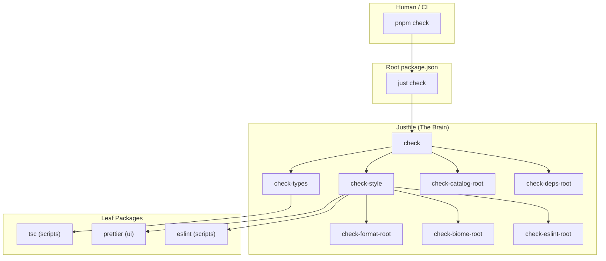

# Monorepo Architecture: The Switchboard Pattern

This architecture strictly separates **Orchestration** (Root) from **Execution**
(Leaves). It eliminates "split-brain" where the root relies on manual scripts
while packages rely on disparate tools.

> [!NOTE] This document describes the architectural pattern implemented in this
> repository using `just` as the task runner.

## 1. Core Philosophy

1.  **The Root is the Interface:** The root `package.json` is for Humans and CI.
    It contains NO logic. Every script delegates to `just`.
2.  **The Leaf is the Implementation:** Package `package.json` files contain the
    raw tools (`vite`, `tsc`, `biome`) or delegate to standard commands.
3.  **Everything is a Node:** `docs`, code, and configuration are all treated as
    nodes in the execution graph orchestrated by `just`.

## 2. The Standard Verbs

Standardize these across the entire repo. If a package doesn't support a verb,
it simply omits the script or recipe.

- **`dev`**: Start development servers (watch mode).
- **`build`**: Compile/transpile for production.
- **`test`**: Run unit/integration tests.
- **`check`**: Read-only validation (Lint, Typecheck, Format Check). Safe for
  CI. Exits 1 on error.
- **`fix`**: Write/Modify validation (Auto-format, Auto-fix). Safe for Local.

---

## 3. Execution Flow Diagram

The following diagram illustrates how a single `pnpm check` command fans out
through Just's task graph:



---

## 4. Configuration & Implementation

### A. The Root `package.json` (The Interface)

**Rationale:** Acts as the entry point. It captures intents, not tools. Every
script delegates to `just`.

```json
{
  "name": "monorepo-root",
  "private": true,
  "packageManager": "pnpm@10.x",
  "scripts": {
    "dev": "just dev",
    "build": "just build",
    "test": "just test",
    "check": "just check",
    "fix": "just fix"
  }
}
```

### B. The `justfile` (The Brain)

**Rationale:** Defines the task dependency graph and orchestration logic.

- **Recipes:** Explicitly define the sequence of operations.
- **Variables:** Manage paths to packages (`ui_pkg`, `scripts_pkg`).

```makefile
# Run all style checks
check-style: check-format-root check-biome-root check-eslint-root check-format check-eslint

# Check formatting for root files
check-format-root:
    pnpm prettier --check "*.{json,md,yaml,yml,js,ts,tsx,jsx,css,html}"

# Check formatting for all packages
check-format:
    cd {{ui_pkg}} && pnpm prettier --check .
    cd {{docs_pkg}} && pnpm prettier --check .
    cd {{scripts_pkg}} && pnpm prettier --check .
```

### C. The Leaf `package.json` (The Code)

**Location:** `crates/tasklens-ui`, `scripts/` **Rationale:** Raw tool execution.

```json
{
  "name": "@mydoo/tasklens-ui",
  "scripts": {
    "build": "dx build --platform web",
    "test-e2e": "playwright test"
  }
}
```

## 5. Handling Specific Scenarios

### Handling Root Files

Root-level files (`README.md`, `eslint.config.js`, `justfile`, etc.) are not
part of any leaf package, so they require explicit Just recipes (`check-*-root`)
to be processed.

The pattern uses multiple root recipes—one per tool—that are wired as dependencies
of the main `check` and `fix` recipes.

```makefile
# The main verbs aggregate all root tasks as dependencies
check-style: check-format-root check-biome-root check-eslint-root

# Prettier: Formats markdown, YAML, and other files at root
check-format-root:
    pnpm prettier --check "*.{json,md,yaml,yml,js,ts,tsx,jsx,css,html}"
```

### The `scripts/` Directory

Per the "Everything is a Node" philosophy, `scripts/` has its own `package.json`
to make it a proper workspace member. This allows it to define its own dependencies
and scripts, which the `justfile` can then orchestrate.

### Sequential Execution

Unlike Turbo, Just executes dependencies sequentially by default. This ensures a
deterministic build order (e.g., `build-core` -> `build-store` -> `build-ui`)
and simplifies debugging. While slightly slower than parallel execution, it
aligns with the goal of reliability and simplicity.
