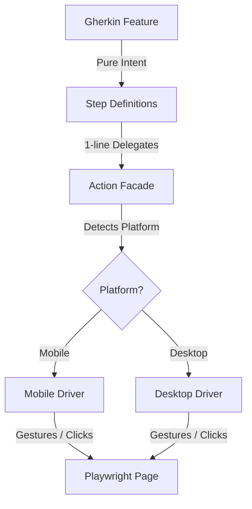

# BDD & Gherkin Guidance: The Opus

> **TL;DR:** Gherkin is an _executable specification language_, not a test
> automation framework. Use it sparingly for core behavioral rules. Keep steps
> thin, platform-neutral, and delegated to action layers. This document
> synthesizes project-specific patterns with general BDD best practices.

---

## 1. Why Gherkin for a Solo Dev?

The common objection: _"Gherkin is for business stakeholders—a solo dev doesn't
need it."_

This assumes human communication is the primary value. For this project, the
stakeholder is **future-you** and **AI agents**. The calculus changes:

| Consumer    | Gherkin Value                                                                        |
| :---------- | :----------------------------------------------------------------------------------- |
| Future-you  | Cognitive compression—scan specs in seconds instead of parsing TypeScript            |
| AI Agents   | Explicit architectural seams for reasoning about intent without implementation noise |
| Refactoring | UI churn hurts less when behavioral intent is stable                                 |

### The Core Insight

You want:

- A **semantic layer** that states _what_ the system does
- Separated from the **mechanical layer** that drives browsers (`page.click()`,
  `expect(locator)`)

Gherkin is one of the few tools that:

1. Is deliberately constrained
2. Resists becoming "just another programming language"

**That constraint is doing real work.**

---

## 2. The Onion Architecture

Platform divergence (Mobile vs. Desktop) is handled at the **Action** layer,
never in Gherkin.



### Layer Responsibilities

| Layer           | Purpose                       | Example                            |
| :-------------- | :---------------------------- | :--------------------------------- |
| Gherkin         | Declarative behavioral intent | `When the user completes the task` |
| Step Definition | Thin binding (1-line)         | `await actions.tasks.complete()`   |
| Action Facade   | Platform-aware routing        | `if (mobile) swipe() else click()` |
| Driver          | Raw Playwright mechanics      | `page.click('.checkbox')`          |

### The Golden Rule

> **Step definitions must be boring.** If a step has branching, loops, or
> assertions beyond delegation—it's doing too much.

---

## 3. The Gherkin Budget

Gherkin becomes a liability if it sprawls. Enforce these limits:

### Global Limits

| Dimension             | Budget                         |
| :-------------------- | :----------------------------- |
| Feature files         | ≤ 5–7 (one per domain concept) |
| Scenarios per feature | ≤ 5–7                          |
| Steps per scenario    | ≤ 6                            |

### What Belongs in Gherkin

- **Core Behaviors:** Things that would appear in a Design Doc or README
- **Invariants:** "A completed order is immutable"
- **Stable Logic:** Authentication, Data Lifecycle, Sync rules
- **Cross-Platform Truths:** Behavior true on both Mobile and Desktop

### What Belongs in Plain Playwright

- **UI Choreography:** "Dropdown closes on outside click"
- **Visuals:** "Tooltip appears after 500ms"
- **Platform Specifics:** Swipe gestures, keyboard shortcuts, hover states
- **Edge Cases:** Network flakes, DOM quirks

### The Decision Heuristics

Before adding a scenario:

1. **Would this appear in a design doc or README?** If yes → Gherkin
2. **If I rewrote the UI from scratch, would this still be true?** If yes →
   Gherkin
3. **Could I explain this behavior without mentioning screens or gestures?** If
   yes → Gherkin
4. **Will I care if this breaks six months from now?** If yes → Gherkin

| Question                           | If yes  | If no   |
| :--------------------------------- | :------ | :------ |
| Describes user-visible behavior?   | Gherkin | TS      |
| Likely stable for years?           | Gherkin | TS      |
| Would appear in docs?              | Gherkin | TS      |
| Requires DOM knowledge to explain? | TS      | Gherkin |
| Mostly about UI choreography?      | TS      | Gherkin |

---

## 4. The Vocabulary Constraint

The most subtle budget dimension. Gherkin vocabulary must use **domain terms**,
never platform or gesture terms.

### This Project's Domain Vocabulary

See [prd.md](../design/prd.md) for the complete dictionary.

| Domain Term             | Meaning                                               |
| :---------------------- | :---------------------------------------------------- |
| **Inbox**               | Special TLI for unfiled tasks (excluded from Balance) |
| **Plan** (View)         | Hierarchical outline tree                             |
| **Do** (View)           | Computed, prioritized execution list                  |
| **Balance** (View)      | Pie chart for Target vs. Actual effort allocation     |
| **Context** / **Place** | Location-based filtering (Home, Work, Anywhere)       |
| **Task**                | The atomic unit of work                               |
| **TLI**                 | Top-Level Item (root tasks like Goals)                |

### Prohibited Vocabulary (Red Flags)

- `tap`, `swipe`, `click`, `long-press` ← Gestures
- `checkbox`, `sidebar`, `hamburger menu` ← UI Elements
- `mobile`, `desktop`, `screen size` ← Platform

### Good vs. Bad Examples

| Bad                              | Good                                 |
| :------------------------------- | :----------------------------------- |
| When I _tap_ the task            | When I _select_ the task             |
| When I _click_ the submit button | When I _submit_ the form             |
| Then the checkbox is checked     | Then the task is marked as completed |

---

## 5. Writing Rules

### Rule 1: Declarative Over Imperative

Gherkin describes _what the user is doing_, not _how_ they do it.

```gherkin
# ❌ Imperative (Low Level)
Given I enter "user1" in the username field
And I enter "password" in the password field
And I click the "Login" button

# ✅ Declarative (High Level)
Given I am logged in as a Premium Member
When I attempt to access the Gold Lounge
Then I should be granted access
```

### Rule 2: No Playwright APIs in Step Definitions

```typescript
// ❌ Bad: Playwright leaking into step layer
When('I click submit', async ({ page }) => {
  await page.click('#submit');
});

// ✅ Good: Delegating to action layer
When('the user submits the form', async ({ actions }) => {
  await actions.form.submit();
});
```

### Rule 3: Assertions in Domain Language

```gherkin
# ❌ Bad: DOM-coupled assertion
Then the element `.completed` is visible

# ✅ Good: Domain-coupled assertion
Then the task is marked as completed
```

Implementation delegates to the assertion layer:

```typescript
Then('the task is marked as completed', async ({ assertions }) => {
  await assertions.tasks.expectCompleted();
});
```

### Rule 4: Prefer State Setup Over UI Setup

```gherkin
# Prefer this (fast, direct state setup)
Given an authenticated user

# Over this (slow, UI-driven setup)
Given I fill in the login form and click submit
```

Step implementation can use API calls, seed state, or bypass UI entirely.

### Rule 5: Parameterization is Dangerous

Use named roles over raw values:

```gherkin
# ✅ Good: Named role
Given a user with expired credentials

# ❌ Avoid: Raw values
When the user signs in with email "x" and password "y"
```

---

## 6. Platform Strategy

### Principle

> Gherkin must **never** branch on platform.

### Feature File (Platform-Agnostic)

```gherkin
Feature: Task Completion

  Scenario: Completing a task updates the plan
    Given a pending task in Do mode
    When the user completes the task
    Then the task is marked complete in the Plan
```

### Action Implementation (Platform-Aware)

```typescript
class TaskActions {
  constructor(
    private platform: Platform,
    private mobileDriver: MobileTaskDriver,
    private desktopDriver: DesktopTaskDriver,
  ) {}

  async completeCurrentTask() {
    if (this.platform === 'mobile') {
      await this.mobileDriver.completeViaSwipe();
    } else {
      await this.desktopDriver.completeViaCheckbox();
    }
  }
}
```

### Platform Detection (Once, at Setup)

```typescript
type Platform = 'mobile' | 'desktop';

function detectPlatform(page: Page): Platform {
  return page.viewportSize()?.width < 768 ? 'mobile' : 'desktop';
}
```

---

## 7. This Project's Architecture

### The 3-Tier Testing Stack

From [AGENTS.md](../../AGENTS.md):

| Tier       | Scope                   | Infrastructure                    | Command         |
| :--------- | :---------------------- | :-------------------------------- | :-------------- |
| **Tier 1** | Pure Logic (`tasklens`) | Node.js                           | `pnpm test`     |
| **Tier 2** | Components (React)      | JSDOM (migrating to Browser Mode) | `pnpm test`     |
| **Tier 3** | E2E Journeys            | Playwright Chromium               | `pnpm test:e2e` |

Gherkin applies to **Tier 3 only**—behavioral journeys across the full stack.

### Existing Fixture Pattern

The project uses a `PlanFixture` interface (see
[fixtures.ts](../../apps/client/tests/e2e/fixtures.ts)) implementing these
action categories:

- **Core Task Operations:** `createTask`, `addChild`, `addSibling`,
  `completeTask`, `deleteTask`
- **Verification Helpers:** `verifyTaskVisible`, `verifyTaskHidden`,
  `verifyTaskCompleted`
- **Mobile Helpers:** `mobileDrillDown`, `mobileNavigateUpLevel`
- **Navigation:** `switchToPlanView`, `switchToDoView`

### Inline Gherkin (Current Pattern)

Until playwright-bdd is adopted, use **Inline Gherkin comments** in
`test.step()` blocks:

```typescript
test('User can complete tasks', async ({ plan }) => {
  await test.step('Setup', async () => {
    // Given a pending task in Do mode
    await plan.primeWithSampleData();
    await plan.switchToDoView();
  });

  await test.step('Complete task', async () => {
    // When the user completes the task
    await plan.completeTask('Research Requirements');

    // Then the task is marked as completed
    await plan.verifyTaskCompleted('Research Requirements');
  });
});
```

---

## 8. Recommended Feature Files for This App

Based on the domain concepts in [prd.md](../design/prd.md):

| Feature File          | Scenarios                                                        |
| :-------------------- | :--------------------------------------------------------------- |
| `planning.feature`    | Create task, Rename task, Add sibling/child, Delete with cascade |
| `execution.feature`   | Complete task, Acknowledge completed tasks, Filtering by Context |
| `balance.feature`     | Adjust target percentages, Thermostat feedback                   |
| `sync.feature`        | Offline edits merge, Healer deduplication                        |
| `persistence.feature` | Data survives reload, IndexedDB integrity                        |

### Scenarios to Exclude (Test in Playwright Directly)

- Drag-and-drop reordering
- Mobile swipe gestures
- Keyboard shortcuts
- Animation timing
- Tooltip hover states

---

## 9. Component Object Model for SPAs

From [docs/design/bdd.md](../design/bdd.md):

Traditional Page Object Model breaks down in SPAs because "pages" aren't
discrete. Use a **Component Object Model** instead:

### Pattern

```typescript
// Component representing a reusable Modal
class UserSettingsModal {
  constructor(private root: Locator) {}

  async changeEmail(newEmail: string) {
    await this.root.getByLabel('Email').fill(newEmail);
    await this.root.getByRole('button', { name: 'Save' }).click();
  }
}

// Page Object assembles components
class ProfilePage {
  settingsModal = new UserSettingsModal(this.page.locator('.modal-container'));

  async openSettings(): Promise<UserSettingsModal> {
    await this.page.getByRole('button', { name: 'Settings' }).click();
    return this.settingsModal;
  }
}
```

### Dialogs as Transient Components

Dialogs float on top of multiple pages—don't "own" them in a single Page Object.

- **Return Values:** When a method opens a dialog, return the Dialog component
  instance.
- **Global Registry:** Store common dialogs (Confirmation, Error) in a shared
  location.

---

## 10. The Final Sanity Check

Before writing any scenario, ask:

> **"If I rewrote the mobile UI from scratch, would this scenario still be
> true?"**

- If **yes** → It belongs in Gherkin
- If **no** → It belongs in Playwright directly

This question cuts through almost every ambiguity.

---

## References

- [docs/design/prd.md](../design/prd.md) — Domain vocabulary and UX specs
- [docs/design/bdd.md](../design/bdd.md) — Component Object Model patterns
- [docs/design/algorithm.md](../design/algorithm.md) — Core prioritization logic
- [AGENTS.md](../../AGENTS.md) — 3-Tier testing architecture
- [fixtures.ts](../../apps/client/tests/e2e/fixtures.ts) — Existing E2E action
  layer
